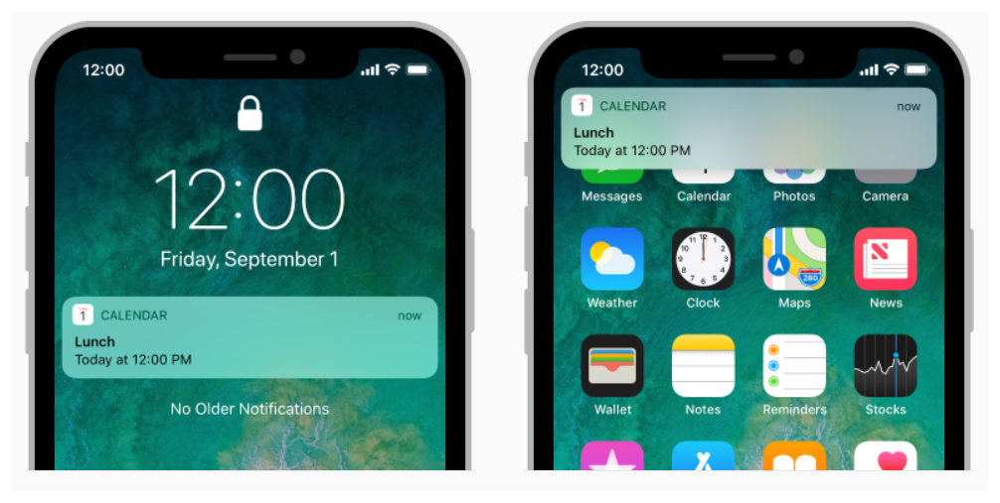
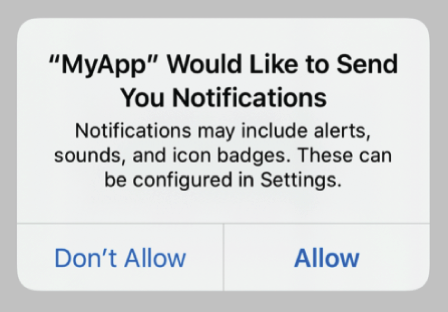

#  User Notifications



**Push user-facing notifications to the user's device from a server or generate them locally from your app**

Notifications can also toell your app to download information and update it's interface. 
Notifications can display an alert, play a sound or badge the app's icons.

You can generate notifications locally from your app or remotely from a server that you manager.

**Local Notifications**
The app creates the notification content and specfiers a condition, like a time or location, that triggers the delivery of the notification.

**Remote Notifications**
Your company's server generates push notifications, and **Apple Push NOtification Server (APNs)** handles the delivery of those notifications tot he user's devices.

Use this framework to do the following:

* Define the types of notifications that your app supports
* Define any custom actions associated with your notification types.
* Schedule local notifications for deliery
* Process already delivered notifications
* Respond to the user-selected actions.

The system makes every attempt to de;liver local and remote notifications ina timely manner, but deliervy isn't guranteed. 

## Topics

* Essentials
* Notifiaction Management
* Remote notififications
* Notification Requests
* Notification Content
* Triggers
* Notification Category and User Actions
* Notification Reponses
* Notification Service App Extension
* Entitlements

# Essentials
## Asking permission to use notifications

Request permission to display alert, play sound or badge the app's icon in response to a notification

Because the user might consider notification-based interactions disruptive, you must obtain permission to use them.



## Explicitly Request Authorization in Context

To ask for authorization, get the shared **UNUserNotificationCenter** instance and call it's **requestAuthorization(options:completionHandler)** method.

Specify all of the interaction types that your app employs. For example, you can request authorization to display alerts, add a badge to the app icon or play sound.

```swift
let center = UNUserNotificationCenter.current()
center.requestAuthorization(options: [.alert, .sound, .badge]) { granted, error in
    if let error = error {
        //Handle the error here
    }
    
    //Enable or disable feature based on the authorization.
}
```

Make the request in a context that helps the user to understand why your app needs authorization. 

## Use Provisional Authorization to Send trial Notifications

When you explicitly ask for permission to send notifications, users must decide whether to permit or deny perimissions before they've seen a notification from your app.

Even if you carefully set the context before requesting authorization, users may not have enough information to make a decision and might reject the authorization.

Use provisional authorization to send notifications on a trial basis. Users can then evaluate the notification and decide whether to authorize them.

The system delivers provisional notifications quetly- they don't interrupt the user with a sound or banner or appear on the lock screen. Instead, they only appear in the notification center's history.
These notification **also include buttons, prompting the user to keep or turn off the notification.**


**To request provisional authorization, add the *provisional* optional when requesting permission to send notifications.**

```swift
let center = UNUserNotificationCenter.current()
center.requestAuthorization(options: [.a;ert, .sound, .badge, .provisional]) { granted, error in
    if let error = error {
        //Handle the error here.
    }
    
    //Provisional authorization granted.
}
``` 

Unlike explicitly requesting authorization, this code doesn't prompt the user for permission to receive notifications. Instead, the first time you call this method, it automcatlcally grants authorization. However, until the user either explicitly keeps or turns off the notification, the authorization status is **UNAuthorizationStatus.provisional**. 

## Customize Notifications Based on the current Authorizations

Always check your app's authorization status before scheduling local notifications. 
Users can change your app's authorization settings at any time. They can also change the type of interactions allowed by your app - which may cause you to alter the number or type of notifications your app sends.

To provide the best experience for your users, call the notification center's **getNotificationSettings(completionHandler)** method to get the current notification settings. Then customize the notification based on these settings.

```swift
let center = UNUserNotificationCenter.current()
center.getNotificationSettings { settings in
    guard (settings.authorizationStatus == .authorized) ||
          (settings.authorizationStatus) == .provisional) else { return }
          
    if settings.alertSetting == .enabled {
        //Schedule an alert-only notification
    } else {
        //Schedule a notification with a badge and sound
    }

}
```

