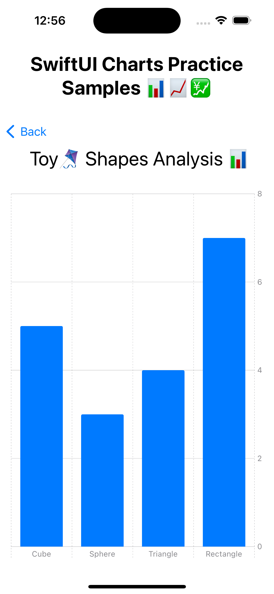
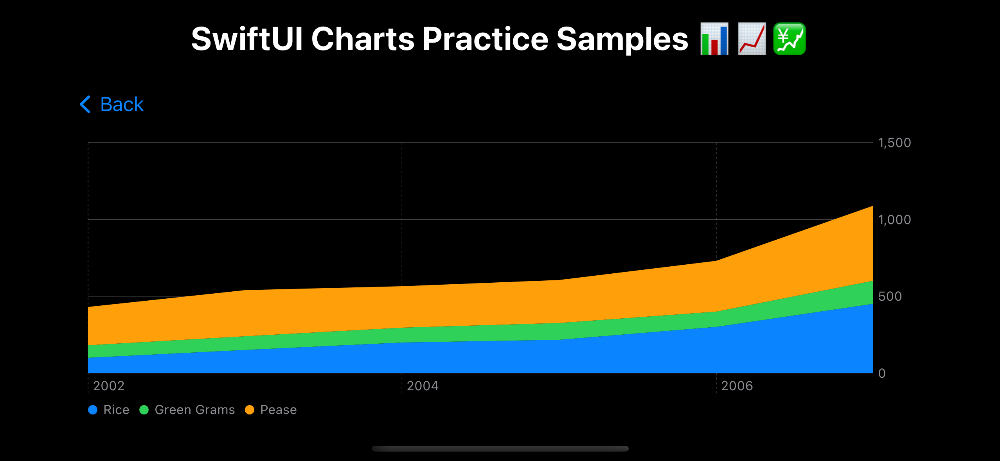

# Swift Charts

Swift charts library enables you to construct and customize charts on every apple platforms. Swift charts is a SwiftUI framework that allows you to transform data into informative visualizations.


You can create a variety of charts such as **Line Charts, bar charts and scatter plots** as shown above.

You can create a dynamic experience by adding animations to your charts.

## Initialize a chart view and create marks
> Create a **Chart view** that serves as a container for the data.

```swift
import SwiftUI
import Charts

struct BarChartView: View {

    var body: some View {
        Chart {
            //Add marks here
        }
    }
}
```

Inside the **Chart {}** specify the graphical marks that represent the data. You can populate it with a variety of marks such as **BarMark, PointMark or LineMark** that plot your data.

```swift
//ToyShapesChartView.swift

import SwiftUI
import Charts

struct BarChartView: View {

    var body: some View {
        Chart {
            ForEach(data){ shape in
                BarMark(
                    x: PlottableValue.value(xAxisLabel, shape.type),
                    y: PlottableValue.value(yAxisLabel, shape.count)
                )
            }
                
        }
    }
}


//ToyShapes.swift

struct ToyShape: Identifiable {
    var id = UUID()
    var type: String
    var count: Double
}

var data: [ToyShape] = [
    ToyShape(type: "Cube", count: 5),
    ToyShape(type: "Sphere", count: 3),
    ToyShape(type: "Triangle", count: 4),
    ToyShape(type: "Rectangle", count: 7),
]
```



# Customize your chart

You can customize the chart to include custom colors by adding **chartForegroundStyleScale() modifier**

``` swift
Chart(seriesData) { series in
        ForEach(series.sales){ element in
            BarMark(
                x: .value("Day", element.weekday, unit: .day),
                y: .value("Sales", element.sales)
            )
            .foregroundStyle(by: .value("City", series.city))
        }
    }
    .chartForegroundStyleScale([
        "Capertino": .orange, "San Fransisco": .green
    ])
```


- - -

# Chart

A swiftUI view that displays a chart

```swift
struct Chart<Content> where Content: ChartContent
```

To create a chart, instantiate a **Chart** with **marks** that display the properties of your data.

```swift
var body: some View {
    Chart {
        LineMark(...)
    }
}

var body: some View {
    Chart {
        BarMark(...)
    }
}

var body: some View {
    Chart {
        PointMark(...)
    }
}
```

## Controlling data series on a chart

You can compose more sophisticated chart marks by providing more than one series of marks to the chart.

```swift
//CompanyProfits.swift

struct CompanyProfits: Identifiable {
    var date: Date
    var profits: Double
    var branchname: String
    var id = UUID()
}

let nairobiBranchProfits: [CompanyProfits] = [
    .init(date: date(2022, 11, 1), profits: 10_000, branchname: "Nairobi"),
    .init(date: date(2022, 11, 2), profits: 11_000 ,branchname: "Nairobi"),
    .init(date: date(2022, 11, 3), profits: 10_500 ,branchname: "Nairobi"),
    .init(date: date(2022, 11, 4), profits: 5_000 ,branchname: "Nairobi"),
    .init(date: date(2022, 11, 5), profits: 16_300 ,branchname: "Nairobi"),
    .init(date: date(2022, 11, 6), profits: 18_000 ,branchname: "Nairobi"),
    .init(date: date(2022, 11, 7), profits: 18_700 ,branchname: "Nairobi"),
    .init(date: date(2022, 11, 8), profits: 20_500 ,branchname: "Nairobi"),
    .init(date: date(2022, 11, 9), profits: 19_600 ,branchname: "Nairobi"),
    .init(date: date(2022, 11, 10), profits: 21_000 ,branchname: "Nairobi"),
    .init(date: date(2022, 11, 11), profits: 22_000 ,branchname: "Nairobi"),
    .init(date: date(2022, 11, 12), profits: 18_000 ,branchname: "Nairobi"),
    .init(date: date(2022, 11, 13), profits: 60_000 ,branchname: "Nairobi"),
    .init(date: date(2022, 11, 14), profits: 30_000 ,branchname: "Nairobi"),
    .init(date: date(2022, 11, 15), profits: 60_000 ,branchname: "Nairobi"),
    .init(date: date(2022, 11, 16), profits: 70_000 ,branchname: "Nairobi"),
]

let kisumuBranchProfits: [CompanyProfits] = [
    .init(date: date(2022, 11, 1), profits: 10_000, branchname: "Kisumu"),
    .init(date: date(2022, 11, 2), profits: 10_300 ,branchname: "Kisumu"),
    .init(date: date(2022, 11, 3), profits: 10_400 ,branchname: "Kisumu"),
    .init(date: date(2022, 11, 4), profits: 9_800 ,branchname: "Kisumu"),
    .init(date: date(2022, 11, 5), profits: 10_900 ,branchname: "Kisumu"),
    .init(date: date(2022, 11, 6), profits: 11_000 ,branchname: "Kisumu"),
    .init(date: date(2022, 11, 7), profits: 10_900 ,branchname: "Kisumu"),
    .init(date: date(2022, 11, 8), profits: 19_500 ,branchname: "Kisumu"),
    .init(date: date(2022, 11, 9), profits: 15_600 ,branchname: "Kisumu"),
    .init(date: date(2022, 11, 10), profits: 18_000 ,branchname: "Kisumu"),
    .init(date: date(2022, 11, 11), profits: 17_000 ,branchname: "Kisumu"),
    .init(date: date(2022, 11, 12), profits: 17_0800 ,branchname: "Kisumu"),
    .init(date: date(2022, 11, 13), profits: 10_000 ,branchname: "Kisumu"),
    .init(date: date(2022, 11, 14), profits: 16_800 ,branchname: "Kisumu"),
    .init(date: date(2022, 11, 15), profits: 20_000 ,branchname: "Kisumu"),
    .init(date: date(2022, 11, 16), profits: 40_000 ,branchname: "Kisumu"),
]


//CompanyProfitsChart.swift

Chart {
    ForEach(nairobiBranchProfits){ element in
        LineMark(
            x: .value("Date", element.date),
            y: .value("Profits", element.profits),
            series: .value("Nairobi Branch", "Nairobi")
        )
        .foregroundStyle(.green)
    }
    
    ForEach(kisumuBranchProfits){ element in
        LineMark(
            x: .value("Date", element.date),
            y: .value("Profits", element.profits),
            series: .value("Kisumu Branch", "Kisumu")
        )
        .foregroundStyle(.orange)
    }
    
    RuleMark(
        y: .value("Good behaviour", 50000)
    )
    .foregroundStyle(.red)
}
.padding()
.navigationTitle("Nairobi vs Kisumu Branch Profits")


```


You indicate which series a LineMark belongs to by specifying it's **series** input parameter.

Use a **RuleMark** to produce a horizontal line segment that displays a constant threshold value across the width of the chart.

- - -

# ChartContent

A type that represents the type of content you draw on a chart.

```swift
protocol ChartContent
```

You build a chart by adding instances that conform to the **ChartContent protocol** to the chart's content closure.

```swift
Chart {
    ChartContent()
    
    ChartContent()
    
    ChartContent()

    ...
}
```

- - -

# Marks
## AreaMark

Chart content that represents data using the area of one or more regions.

```swift
//FoodData.swift
struct FoodPrice: Identifiable {
    var id = UUID()
    var name: String
    var cost: Double
    var date: Date
    
    init(name: String, cost: Double, year: Int){
        self.name = name
        self.cost = cost
        
        let calendar = Calendar.autoupdatingCurrent
        self.date = calendar.date(from: DateComponents(year: year))!
    }
}


let riceCosts: [FoodPrice] = [
    .init(name: "Rice", cost: 100, year: 2002),
    .init(name: "Rice", cost: 150, year: 2003),
    .init(name: "Rice", cost: 200, year: 2004),
    .init(name: "Rice", cost: 217, year: 2005),
    .init(name: "Rice", cost: 300, year: 2006),
    .init(name: "Rice", cost: 450, year: 2007),
]


//FoodAreaMark.swift

Chart(riceCosts) { element in
    AreaMark(
        x: .value("Year", element.date),
        y: .value("Price", element.cost)
    )
    .foregroundStyle(.orange)
}
.padding()
.navigationTitle("Rice Prices Between 2001 and 2007")
```


**You can add more details with a stacked chart**

```swift

//FoodData.swift

struct FoodPrice: Identifiable {
    var id = UUID()
    var name: String
    var cost: Double
    var date: Date
    
    init(name: String, cost: Double, year: Int){
        self.name = name
        self.cost = cost
        
        let calendar = Calendar.autoupdatingCurrent
        self.date = calendar.date(from: DateComponents(year: year))!
    }
}


//data
let cerealsPrices: [FoodPrice] = [
    .init(name: "Rice", cost: 100, year: 2002),
    .init(name: "Green Grams", cost: 80, year: 2002),
    .init(name: "Pease", cost: 250, year: 2002),
    
    .init(name: "Rice", cost: 150, year: 2003),
    .init(name: "Green Grams", cost: 90, year: 2003),
    .init(name: "Pease", cost: 300, year: 2003),
    
    .init(name: "Rice", cost: 200, year: 2004),
    .init(name: "Green Grams", cost: 95, year: 2004),
    .init(name: "Pease", cost: 270, year: 2004),
    
    .init(name: "Rice", cost: 217, year: 2005),
    .init(name: "Green Grams", cost: 110, year: 2005),
    .init(name: "Pease", cost: 280, year: 2005),
    
    .init(name: "Rice", cost: 300, year: 2006),
    .init(name: "Green Grams", cost: 100, year: 2006),
    .init(name: "Pease", cost: 330, year: 2006),
    
    .init(name: "Rice", cost: 450, year: 2007),
    .init(name: "Green Grams", cost: 150, year: 2007),
    .init(name: "Pease", cost: 490, year: 2007),
]

//FoodStackedAreaMarkChart.swift

Chart(cerealsPrices) { element in
    AreaMark(
        x: .value("Year", element.date),
        y: .value("Price", element.cost)
    )
    .foregroundStyle(by: .value("Food Item", element.name))
}
.padding()

```



## LineMark

Chart content that represents data using a sequence of conected line segments.

You create a line chart by plotting the data category in x axis and plotting the number category in the y axis.


```swift
//SunshineData.swift
struct hoursOfSunshine: Identifiable {
    var id =  UUID()
    var date: Date
    var county: String
    var hoursOfSunshine: Double
    
    init(month: Int, hoursOfSunshine: Double, county: String){
        self.hoursOfSunshine = hoursOfSunshine
        let calendar = Calendar.autoupdatingCurrent
        self.date = calendar.date(from: DateComponents(year: 2022, month: month))!
        self.county = county
    }
}

let sunshineData: [hoursOfSunshine] = [
    .init(month: 1, hoursOfSunshine: 90, county: "Nairobi"),
    .init(month: 1, hoursOfSunshine: 94, county: "Kisumu"),
    .init(month: 1, hoursOfSunshine: 110, county: "Garisa"),
    
    .init(month: 2, hoursOfSunshine: 89, county: "Nairobi"),
    .init(month: 2, hoursOfSunshine: 90, county: "Kisumu"),
    .init(month: 2, hoursOfSunshine: 110, county: "Garisa"),
    
    .init(month: 3, hoursOfSunshine: 20, county: "Nairobi"),
    .init(month: 3, hoursOfSunshine: 79, county: "Kisumu"),
    .init(month: 3, hoursOfSunshine: 110, county: "Garisa"),
    
    .init(month: 4, hoursOfSunshine: 25, county: "Nairobi"),
    .init(month: 4, hoursOfSunshine: 60, county: "Kisumu"),
    .init(month: 4, hoursOfSunshine: 100, county: "Garisa"),
    
    .init(month: 5, hoursOfSunshine: 30, county: "Nairobi"),
    .init(month: 5, hoursOfSunshine: 70, county: "Kisumu"),
    .init(month: 5, hoursOfSunshine: 90, county: "Garisa"),
    
    .init(month: 6, hoursOfSunshine: 60, county: "Nairobi"),
    .init(month: 6, hoursOfSunshine: 60, county: "Kisumu"),
    .init(month: 6, hoursOfSunshine: 95, county: "Garisa"),
    
    .init(month: 7, hoursOfSunshine: 10, county: "Nairobi"),
    .init(month: 7, hoursOfSunshine: 80, county: "Kisumu"),
    .init(month: 7, hoursOfSunshine: 100, county: "Garisa"),
    
    .init(month: 8, hoursOfSunshine: 15, county: "Nairobi"),
    .init(month: 8, hoursOfSunshine: 65, county: "Kisumu"),
    .init(month: 8, hoursOfSunshine: 115, county: "Garisa"),
    
    .init(month: 9, hoursOfSunshine: 77, county: "Nairobi"),
    .init(month: 9, hoursOfSunshine: 97, county: "Kisumu"),
    .init(month: 9, hoursOfSunshine: 177, county: "Garisa"),
    
    .init(month: 10, hoursOfSunshine: 80, county: "Nairobi"),
    .init(month: 10, hoursOfSunshine: 80, county: "Kisumu"),
    .init(month: 10, hoursOfSunshine: 90, county: "Garisa"),
    
    .init(month: 11, hoursOfSunshine: 79, county: "Nairobi"),
    .init(month: 11, hoursOfSunshine: 79, county: "Kisumu"),
    .init(month: 11, hoursOfSunshine: 99, county: "Garisa"),
    
    .init(month: 12, hoursOfSunshine: 47, county: "Nairobi"),
    .init(month: 12, hoursOfSunshine: 67, county: "Kisumu"),
    .init(month: 12, hoursOfSunshine: 97, county: "Garisa")
]


//SunshineLineMark.swift
Chart(sunshineData) { element in
    LineMark(
        x: .value("Date", element.date),
        y: .value("Sun 🌞 Hours", element.hoursOfSunshine)
    )
    .foregroundStyle(by: .value("County", element.county))
}
.padding()
.navigationTitle("Sunshines Hours")

```


- - - 

## PointMark

Chart content that represent data using points.

```swift
struct ApolloStageBurnData: Identifiable {
    var id = UUID()
    let durationSecond: Double
    let stage: String
    let rocket: String
}

let stageBurnData: [ApolloStageBurnData] = [
    .init(durationSecond: 0, stage: "Pre-Staging", rocket: "Apollo 7"),
    .init(durationSecond: 0, stage: "Pre-Staging", rocket: "Apollo 8"),
    .init(durationSecond: 0, stage: "Pre-Staging", rocket: "Apollo 9"),
    .init(durationSecond: 0, stage: "Pre-Staging", rocket: "Apollo 10"),
    .init(durationSecond: 0, stage: "Pre-Staging", rocket: "Apollo 11"),
    .init(durationSecond: 0, stage: "Pre-Staging", rocket: "Apollo 12"),
    .init(durationSecond: 0, stage: "Pre-Staging", rocket: "Apollo 13"),
    .init(durationSecond: 0, stage: "Pre-Staging", rocket: "Apollo 14"),
    .init(durationSecond: 0, stage: "Pre-Staging", rocket: "Apollo 15"),
    .init(durationSecond: 0, stage: "Pre-Staging", rocket: "Apollo 16"),
    .init(durationSecond: 0, stage: "Pre-Staging", rocket: "Apollo 17"),
    
    .init(durationSecond: 147.31, stage: "S-IC Stage Burn", rocket: "Apollo 7"),
    .init(durationSecond: 160.41, stage: "S-IC Stage Burn", rocket: "Apollo 8"),
    .init(durationSecond: 169.06, stage: "S-IC Stage Burn", rocket: "Apollo 9"),
    .init(durationSecond: 168.03, stage: "S-IC Stage Burn", rocket: "Apollo 10"),
    .init(durationSecond: 168.03, stage: "S-IC Stage Burn", rocket: "Apollo 11"),
    .init(durationSecond: 168.2, stage: "S-IC Stage Burn", rocket: "Apollo 12"),
    .init(durationSecond: 170.3, stage: "S-IC Stage Burn", rocket: "Apollo 13"),
    .init(durationSecond: 170.6, stage: "S-IC Stage Burn", rocket: "Apollo 14"),
    .init(durationSecond: 166.1, stage: "S-IC Stage Burn", rocket: "Apollo 15"),
    .init(durationSecond: 168.5, stage: "S-IC Stage Burn", rocket: "Apollo 16"),
    .init(durationSecond: 168.1, stage: "S-IC Stage Burn", rocket: "Apollo 17"),
    
    .init(durationSecond: 0, stage: "S-II Stage Burn", rocket: "Apollo 7"),
    .init(durationSecond: 367.85, stage: "S-II Stage Burn", rocket: "Apollo 8"),
    .init(durationSecond: 371.06, stage: "S-II Stage Burn", rocket: "Apollo 9"),
    .init(durationSecond: 388.59, stage: "S-II Stage Burn", rocket: "Apollo 10"),
    .init(durationSecond: 384.22, stage: "S-II Stage Burn", rocket: "Apollo 11"),
    .init(durationSecond: 389.14, stage: "S-II Stage Burn", rocket: "Apollo 12"),
    .init(durationSecond: 426.64, stage: "S-II Stage Burn", rocket: "Apollo 13"),
    .init(durationSecond: 392.55, stage: "S-II Stage Burn", rocket: "Apollo 14"),
    .init(durationSecond: 386.06, stage: "S-II Stage Burn", rocket: "Apollo 15"),
    .init(durationSecond: 394.34, stage: "S-II Stage Burn", rocket: "Apollo 16"),
    .init(durationSecond: 395.06, stage: "S-II Stage Burn", rocket: "Apollo 17"),
    
    .init(durationSecond: 469.79, stage: "S-IVB First Burn", rocket: "Apollo 7"),
    .init(durationSecond: 156.69, stage: "S-IVB First Burn", rocket: "Apollo 8"),
    .init(durationSecond: 123.84, stage: "S-IVB First Burn", rocket: "Apollo 9"),
    .init(durationSecond: 146.95, stage: "S-IVB First Burn", rocket: "Apollo 10"),
    .init(durationSecond: 147.13, stage: "S-IVB First Burn", rocket: "Apollo 11"),
    .init(durationSecond: 137.31, stage: "S-IVB First Burn", rocket: "Apollo 12"),
    .init(durationSecond: 152.93, stage: "S-IVB First Burn", rocket: "Apollo 13"),
    .init(durationSecond: 137.16, stage: "S-IVB First Burn", rocket: "Apollo 14"),
    .init(durationSecond: 141.47, stage: "S-IVB First Burn", rocket: "Apollo 15"),
    .init(durationSecond: 142.61, stage: "S-IVB First Burn", rocket: "Apollo 16"),
    .init(durationSecond: 138.85, stage: "S-IVB First Burn", rocket: "Apollo 17"),
    
    .init(durationSecond: 0, stage: "S-IVB Third Burn", rocket: "Apollo 7"),
    .init(durationSecond: 317.72, stage: "S-IVB Third Burn", rocket: "Apollo 8"),
    .init(durationSecond: 62.06, stage: "S-IVB Third Burn", rocket: "Apollo 9"),
    .init(durationSecond: 343.06, stage: "S-IVB Third Burn", rocket: "Apollo 10"),
    .init(durationSecond: 346.83, stage: "S-IVB Third Burn", rocket: "Apollo 11"),
    .init(durationSecond: 341.14, stage: "S-IVB Third Burn", rocket: "Apollo 12"),
    .init(durationSecond: 350.85, stage: "S-IVB Third Burn", rocket: "Apollo 13"),
    .init(durationSecond: 350.84, stage: "S-IVB Third Burn", rocket: "Apollo 14"),
    .init(durationSecond: 350.71, stage: "S-IVB Third Burn", rocket: "Apollo 15"),
    .init(durationSecond: 341.92, stage: "S-IVB Third Burn", rocket: "Apollo 16"),
    .init(durationSecond: 351.04, stage: "S-IVB Third Burn", rocket: "Apollo 17")
]


Chart(stageBurnData) { element in
    PointMark(
        x: .value("Rocket", element.rocket),
        y: .value("Burn Duration", element.durationSecond)
    )
    .foregroundStyle(by: .value("Stage", element.stage))
}
.padding()
.navigationTitle("Apollo Rockets Ascent Data")

```


- - -

## RectangleMark

Chart content that represents data using rectangles.

- - -

## RuleMark

Chart content that represents data using a single horizontal or vertical rule.

```swift
Chart {
    RuleMark(
        y: .value("Threshold", 51)
    )
    .foregroundStyle(.red)
}
```


- - -

## BarMark

Chart content that represents data using Bars.

- - -
