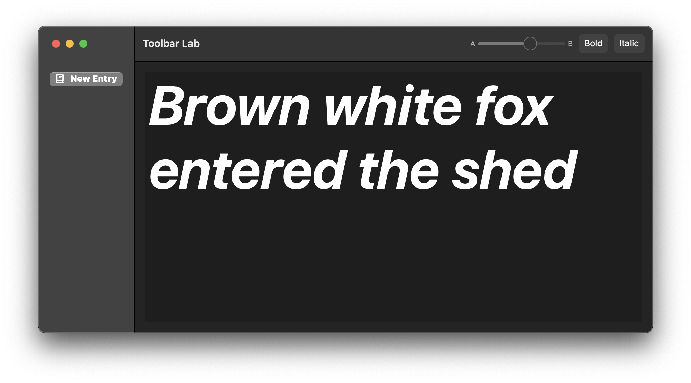

# SwiftUI Toolbar
The system might present the toolbar above or below your app's contents.
Add items to a toolbar by using **toolbar(content:) view modifier**.

**toolbar(content:)**

Populates the toolbar or navigation bar with views you provide.

Use this modifier to add content /views to the toolbar.

The toolbar modifier expects a collection of toolbar items, that you can provide either by **supplying a collection of views with each view wrapped in a ToolbarItem**, or by providing a collection of views as a **ToolbarItemGroup**.
```swift

//NotePadView.swift 

struct NotePadView: View {
    @State var notes: String = "Brown white fox entered the shed"
    @State var bold: Bool = false
    @State var italic: Bool = false
    @State var fontSize: Double = 12.5
    
    var displayFont: Font {
        let font = Font.system(size: CGFloat(fontSize),
                               weight: bold == true ? .bold : .regular)
        return italic == true ? font.italic() : font
    }
    
    var body: some View {
        VStack {
            TextEditor(text: $notes)
                .font(displayFont)
        }
        .toolbar {
            ToolbarItemGroup {
                Slider(value: $fontSize,
                       in: 8...125,
                       minimumValueLabel: Text("A"),
                       maximumValueLabel: Text("B"))
                {
                    Text("Font Size")
                }
                .frame(width: 150)
                
                Toggle("Bold", isOn: $bold)
                
                Toggle("Italic", isOn: $italic)
            }
        }
        .navigationTitle("Toolbar Lab")
        .padding()
    }
}
```

