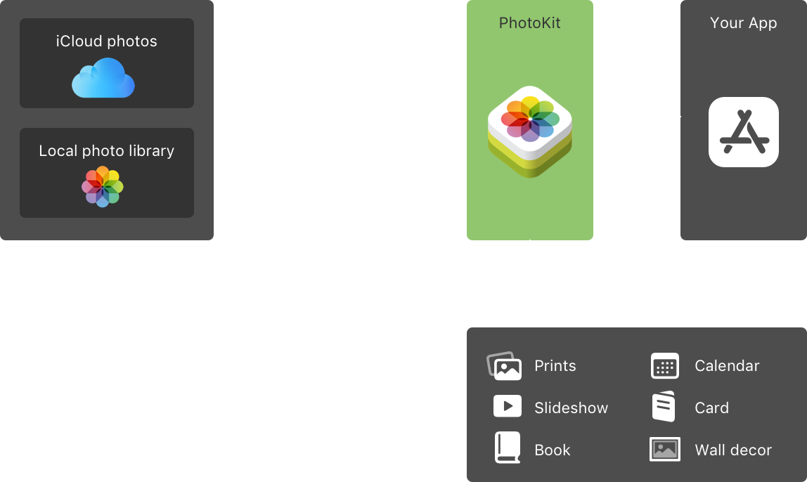

# PhotoKit

PhotoKit enables the developer to work with **image and video assets** managed by the **Photos App**, **iCloud Photos** and **Live Photos**




In **iOS macOS and tvOS** PhotoKit provides classes that support working with photos and extending Photos App.

# Key Topics

## Photos Picker
> **Selecting photos and videos**

>  **PHPickerViewController**
## Shared Photo Library
 > **Privacy in photos apps**

 > **Browsing and modifying photo albums**


## Asset Retrieval
> **Fetching objects and Requesting Changes**

## Asset Loading
> **Loading and Caching Assets and Thumbnails**

## Live Photos
> **Displaying Live Photos**
## Asset Resource Management
## Photo Editing Extensions
## macOS Photos Project Extensions
## Photo Errors

- - -

# Selecting Photos and Videos in iOS

You can use **PhotoKit** to filter assets according to the user's selection.

## Benefits of Photo Picker
Both PHPickerViewController and UIImagePickerController use an out of process photos picker user interface. PHPickerViewController contains additional powerful APIs which make it better than UIImagePickerController.

App's don't need to ask permissions while using PHPickerViewController or UIImageViewController.

An app that saves photos to the gallery can use **Add Photos Only Permission** level when requesting authorization.

## Configure the Photos Picker

Create a **PHPickerConfiguration**. This only provides access to asset data and does not include asset identifiers.

```swift
var configuration = PHPickerConfiguration(photoLibrary: .shared())
```

The picker displays all asset types by default. A filter may configure the picker to display **videos, images with live photos or live photos only**

```swift
var filter = PHPickerFilter.any(of: [.livePhotos, .videos])
```

In iOS 15 you can also configure the selection mode so that the user can select or diselect multiple photos.

```swift
var configuration = PHPickerConfiguration(photoLibrary: .shared())

configuration.selection = .ordered
configuration.selectionLimit = 4
```

## Display a picker with the configuration

```swift
var configuration = PHPickerConfiguration(photoLibrary: .shared())

...

let picker = PHPickerViewController(configuration: configutation)
picker.delegate = self
present(picker, animated: true)
```

## Load back the store image

```swift
let fetchResult: PHFetchResult<PHAsset> = PHAsset.fetchAssets(withLocalIdentifiers: [imageIdentifier], options: nil)
    
    if let phAsset = fetchResult.firstObject {

    let imageManager = PHImageManager()

    imageManager.requestImage(for: phAsset, targetSize: PHImageManagerMaximumSize, contentMode: .aspectFit, options: nil) { (resultImage, _ ) in
                            
        if let previouslySelectedImage = resultImage {
            self.selectedImage = Image(uiImage: previouslySelectedImage)
        }
    }
}
```
- - -

## Working with PhotoKit in SwiftUI
### UIViewControllerRepresentable

The **UIViewControllerRepresentable** is a view that represents a UIKit view controller in SwiftUI interface.

This is used to create, update and tear down your view controller.

> makeUIViewController(contenxt:)

Creates the view controller object and configures it's state.

> updateUIViewController(controllerType, context)

Update this View controller with information from SwiftUI

> dismantleUIViewController(type, coordinator)

Cleans up the presented view controller in anticipation for their removal.

- - -

## PHAsset

> Representation of an photo, livePhoto or video in the Photos Libary.

PHAsset represents the Asset you want to display or edit after fetching.

## PHFetchResult
An ordered list of assetsor collections returned from a photo fetch method.


```swift
let fetchResult: PHFetchResult<PHAsset> = PHAsset.fetchAsset  (withLocalIdentifiers: [imageIdentifier], options: nil)
```


