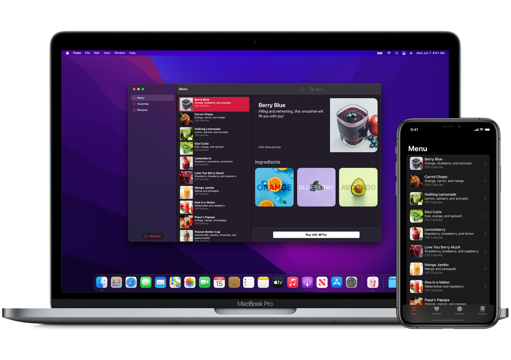
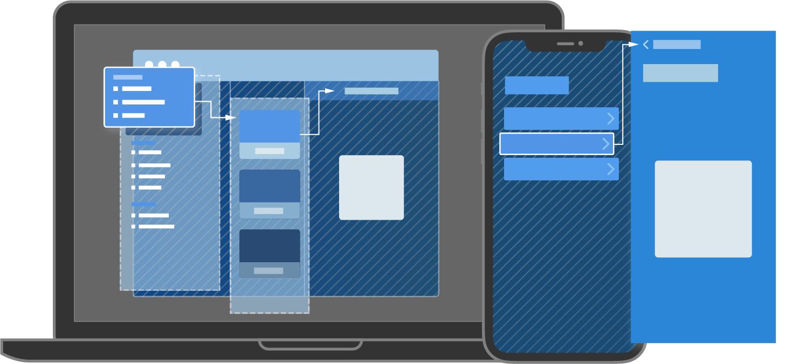
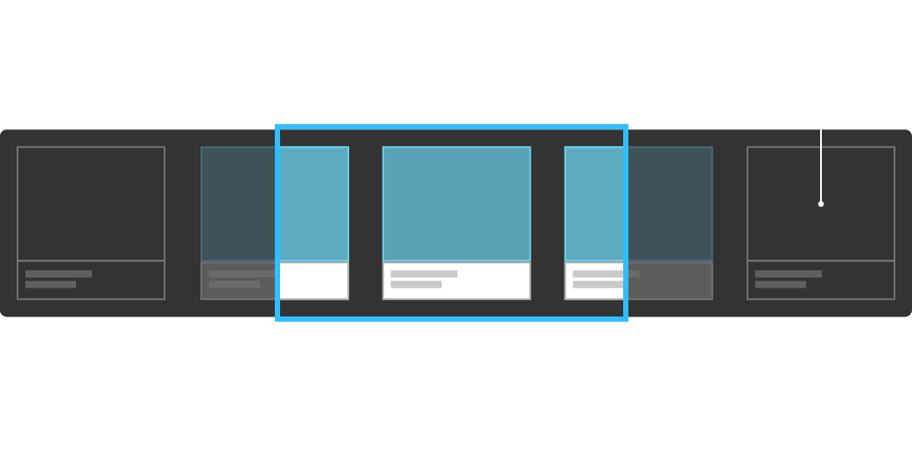

## SwiftUI & iOS development concepts code lab



> Contains sample projects with documentation

### Overview

SwiftUI provides **views**, **controls** and **layout structures** for declaraing your app's user interface. The framework provides **event handlers** for delivering taps,**gestures** and other types of input to your app, and tools to manage the flow of data from your app's models down to the views and **controls** that users will see and interact with.

Define the app structure using the **App protocol**, and populate it with scenes that contain the views that make up your app's user interface.

Create your own custom views that conform to the **View protocol** , and compose them with **SwiftUI Views** for displaying **text**, **imagess**, and custom **shapes** using stack,list and more.

> You can integrate SwiftUI views with objects from *UIKit* , *AppKit* and *WatchKit* frameworks to take further advantage of platform-specific functionality.

> You can also customize **accessibility** support in SwiftUI, and **localize** your app's user interface for different languages,countries and cultural regions.

### Swift UI Navigation

You add navigation capabilities to a view by emebedding it in a NavigationView, and then nesting each row in a **NavigationView**,
and then nesting navigation view in a **NavigationLink** to set up a transition to a destination view.


### Data Binding
```swift
@EnvironmentObject annotation is used in views that are lower 
down in the view hierarchy to receive data 
from views that are higher up.

```

```swift
The **environmentObject(_:) modifier can be applied so that 
views further down in the view hierarchy can 
read data objects passed down through the environment.
```

> Binding is a value and a way to change that value.

```swift
A binding controls the storage for a value, 
so you can pass data around to different views 
that need to read or write it.

You can use binding to plumb data throughout your 
app's views; bindings aren't limited to just two views.

```
### Creating State for a View

> **@State** 

```swift
Use the @State property wrapper to mark a value as state, 
declare the property as private, and give it a a default value.

@State private var showFavoritesOnly = false

@State private var defaultCountry = "Kenya"

```

### Drawing Paths and Shapes

> **GeometryReader**

You use GeometryReader to dynamically drawa, position, and size views instead of hard-coding number that might not
be correct when you reuse a view somewhere else in your app, or on a difference sized display.

**GeometryReader** dynamically reports size and position information about the parent view and the device, and updates whenever the size changes; for example, when the user rotates their iPhone.

> **ZStack**

ZStack overlays views on top of each other

```swift

ZStack {
   Circle().fill(.green)
   Circle().fill(.yellow).scaleEffect(0.8)
   Circle().fill(.orange).scaleEffect(0.6)
   Circle().fill(.red).scaleEffect(0.4)
}

```
> **Data**

A byte buffer in memory

The **Data** value type allows simple byte buffers to take on the behaviour of **Foundation objects**.

You can create empty or pre-populated buffers from a variety of sources and later add or remove bytes.
You can filter and sort the content, or compare against other buffers. You can manipulate subranges of bytes
and iterate over some or all of them.

Data bridges to the **NSData** class and its mutable subclass, **NSMutableData**. 
You can use these interchangeably in code that interacts with **Objective-C APIs**

> **ObservableObject**

A type of object with a *publisher* that emits before the object has changed.

By defaut an **ObservableObject** synthesizes an *objectWillChange* publisher that emits the changed value before any of its **@Published** properties changes.

```swift
class Contact: ObservableObject {
    @Published var name: String
    @Published var age: Int
    
    init(name: String, age: Int){
        self.name = name
        self.age = age
    }
    
    func haveBirthday() -> Int {
        age += 1
        return age
    }
}

let john = Contact(name: "John Fisher", age: 24)

cancellable = john.objectWillChange
            .sink {_ in 
                print("\(john.age) will change")
            }

print(john.haveBirthday())
//prints "24 will change"
//prints "25"

```

> **@Published**

A type that publishes a property marked with an attribute.

```swift
@propertywrapper struct Published<Value>

```

Publishing a property with the @Published attribute creates a publisher of this type. You access the publisher with the $ operator.

```swift
class Weather {

    @Published var temperatur: Double 
    
    init(temperatur: Double) {
        self.temperature = temperature
    }
}

let weather = Weather(temperature: 20)

cancellable = weather.$temperature
    .sink() {
       print("Temperature now: \($0)") 
    }
    
weather.temperature = 25

//prints:
// Temperature now: 20.0
// Temperature now: 25.0

```

> Important!

> The @Publisher attribute is clas constrained. Use it with properties of classes, not with non-clas types like structures.


> **SwiftUI @EnvironmentObject

A property wrapper type for an observable object supplied by a parent or ancestor view.

```swift

@frozen @propertywrapper 
struct EnvironmentObject<ObjectType> where ObjectType : ObservableObject

```

For data that should be shared with many views in your app, SwiftUI gives you the *@EnvironmentObject property wrapper*.
This lets you share model data anywhere it's needed, while also ensuring that your views automatically stay updated when that data changes.

> Rather than creating some data in **view A**, and then passing it to **view B**, then **view C**, then **view D** beffore finally using it, you can create it in **view A** and put it into the environment so that views B, C and D will automattically have access to it.

Just like **@ObservableObject**, you never assign a value to an **@EnvironmentObject property**. Instead, it should be passed in from elsewhere, and ultimately you're probably going to want to use **@StateObject** to create it.

Unlike **@ObservableObject** we don't pass our objects into other views by hand. Instead, we send the data into a modifier called **environmentObject()**, which makes the object available in SwiftUI's environment for that view plus any others inside it.

> **@StateObject**

A property wrapper type that instantiates an observable object.

```swift

Declaration

@frozen @propertyWrapper 
struct StateObject<ObjectType> where ObjectType : ObservableObject

```

Create a state object in a **View**, **App** or **Scene** by applying the **@StateObject** attribute to a property declaration and providing an initial value that conforms to the **ObservableObject** protocol:

```swift

@StateObject var model = DataModel() 

//where DataModel() conforms to ObservableObject

class DataModel: ObservableObject {
    @Published var modelProperty: String = "some-text-like-hello"
    @Published var isEnabled: Bool = false
}

```

SwiftUI creates a new instance of the object only once for each instance of the struture that declares the object. 
When published properties of the observable object change e.g. the "modelProperty" in the example, SwiftUI updates the parts of any view that depends on those properties:

```swift

Text(model.modelProperty)

//Update the view any time 'modelProperty' changes

```

You can pass the state object into a property that has the **ObservableObject** attribute.

You can alternatively add the object to the environment of a view hierarchy by applying the environmentObject(_ :) modifier.

```swift

ContentView()
    .environmentObject(model)

```

If you create an environment object as shown in the code above, you can read the object inside ContentView or any of it's descendants using the **EnvironmentObject attribute**

```swift

@EnvironmentObject var model: DataModel()

```

Get a **Binding** to one of the state object's properties using the **$ operator**. 
Use a binding when you want to create a two-way connection to one of the object's properties. 
For example, you can let a Toggle control a Boolean value called isEnabled store in the model:


```swift

Toggle("Checkout Enabled", isOn: $model.isEnabled)

```

## Navigation



> **NavigationView**

A view for presenting a stack of views that represents a visible path in a navigation hierarchy.

```swift

Declaration

struct NavigationView<Content> where Content: View

```

Use a **NavigationView** to create a *navigation-based app* in which the user can traverse a collection of views.
Users navigate to a destination view by selectiong a **NavigationLink** that you provide.

On **iPadOS** and **macOS**, the destination content appears in the text column. Other platforms push a new view onto the stack and enable removing items from the stack with platform specific controls, like a Back button or a swipe gesture.

Use the **init(content:)** initializer to create a navigation view that directly associates navigation links and their destination views:

```swift

NavigationView {
    List(model.notes) { note in 
        NavigationLink(note.title, destination: NoteEditor(id: note.id))
    }
    
    Text("Select a note entry")
}

```

Style a navigation view by modifying it with the **navigationViewStyle(_:)**

Use other modifiers, like **navigationTitle()**, on views presented by navigation view to customize the navigation interface for the presented view.


> **NavigationLink**

A view that controls a navigation presentation

```swift

Declaration

struct NavigationLink<Label, Destination> where Label: View, Destination : View

```

Users click or tap a navigation link to present a view inside a NavigationView.
You control the visual appearance of the link by providing view content in the link's trailing closure.

```swift

NavigationLink(destination: FolderList(id: workFolder.id)) {
    Label("Work Folder", systemImage: "folder")
}

```

For link composed only of text, you can use one of the convinience initializers that takes a string and creates a **Text** view for you.

```swift

NavigationLink("Work Folder", destination: FolderList(id: workFolder.id))

```

- - -

## Layouts

### VStack

> A view that arranges its children in a vertical line.

```swift

Declaration

@frozen struct VStack<Content> where Content: View

```

Unlike **LazyVStack**, which only renders the views when your app needs to display them onscreen, a VStack renders the views all at once, regardless of whether they are on- or offscreen.

Use the regular VStack when you have a small number of child views or don't want the delayed rendering behaviour of the "lazy" version.

```swift

//Example

var body: some View {
    VStack(alignment: .leading, spacing: 10) {
        ForEach(1..10, id: \.self){
            Text("Item \($0)")
        }
    }
}

```

### HStack

> A view that arranges its children in a horizontal line.

```swift

Declaration

@frozen struct HStack<Content> where Content: View

```

Unlike **LazyHStack**, which only renders the views when your app needs to display them onscreen, an HStack renders the views all at once, regardless of whether they are on- or offscreen. 

```swift

var body: some View {
    HStack(
        alignment: .top,
        spacing: 10
    ) {
        ForEach(
            1...5,
            id: \.self
        ) {
            Text("Item \($0)")
        }
    }
}

```

- - -

### ScrollView

> Scrollable view.

The scroll view displays its contents within the scrollable content region. 
ScrollView can scroll vertically, horizontally or both.

```swift

var body: some View {
    ScrollView {
        VStack(alignment: .leading) {
            ForEach(0..<100) {
                Text("Row \($0)")
            }
        }   
    }
}

```

- - -

## Date and Time

> **Date**

A specific point in time, independent of any calendar or time zone.

```swift

Declaration

struct Date

```

A date value encapsulates a single point in time, independent of any particular calendrical system or time zone. Date values represent a time interval relative to an absolute reference date.

The Date structure provides methods for comparing dates, calculating the time interval between two date and creating a new date from a time interval relative to another date.

Use date values in conjuction with **DateFormatter** instances to create localized representations of date and times and with instances to perform calendar sirthmentic.

> **DateFormatter**

A formatter that converts between dates and their textual representations.

```swift

Declaration

class DateFormatter: Formatter

```

Instances of DateFormatter creat string representations of **NSDate** objects, and convert textual representations of dates and times into **NSDate** objects.

### Working with User-Visible Representations of Dates and Times

When displaying a date to a user, you set the **dateStyle** and **timeStyle** properties of the dateFormatter according to your particular needs.
For example, if you want to show the month, data and year without showing the time, you would set the **dateStyle** property to **DateFormatter.Style.long** property to **DateFormatter.Style.long** .

```swift

let dateFormatter = DateFormatter()
dateFormatter.dateStyle = .medium
dateFormatter.timeStyle = .none

let date = Date()

//US english locale (en_US)

dateFormatter.locale = Locale(indentifier: "en_US")

```

If you want to define a format that cannot be achieved using the predefines styles, you can use the **setLocalizedDateFormatFromTemplate()** to specify a localized date format fromm a template.

```swift

let dateFormatter = DateFormatter()
let date = Date()

dateFormatter.locale = Locale(identifier: "en_GB")
dateFormatter.setLocalizedDateFromTemplate("MMMMd")

```


> **Calendar**

A definition of the relationships between calendar units (such as eras, years and weekdays) and absolute points in time, providing calculation and comparison of date.


- - -

## CaseIterable Protocol

A type that provides a collection of all of its values

```swift

Declaration

protocol CaseIterable

```

When using a **CaseIterable type**, you can access a collection of all the type's cases by using the type's **allCases property**.

```swift

enum CompassDirection: CaseIterable {
    case north, south, east, west
}

print("There are \(CompassDirection.allCases.count) directions.")

//prints "There are 4  directions."

let caseList = CompassDirection.allCases
                                .map({case "\(case)"})
                                .joined(seperator: ", ")
                                
// caseList contains ==> "north, south, east, west"

```

You can take advantage of this compiler support when defining your own custom enumeration by declaring conformance to **CaseIterable** in the enumeration's original declaration. 


- - -

## Environment @Environment

A property wrapper that reads a value from a view's environment.

Use the **Environment property** wrapper to read a value stored in a view's environment. Indicate the value to read using an **EnvironmentValues** key path in the property declaration.
For example you an create a property that read the color scheme of the current view using the key path of the **colorScheme** property.

```swift

@Environment(\.colorScheme) var colorScheme: ColorScheme

or

@Environment(\.editMode) var editMode: EditMode

```

You can condition a view's content on the associated value, which you can read from the declared property's **wrapperValue**. As with any property wrapper, you access the wrapped value by directly referrring to the property:

```swift

if colorScheme == .dark { //checks the wrapped value
    DarkContentView()
} else {
    LightContentView()
}

```

If the value changes, SwiftUI updates any parts of your view that depends on the value. For example is user changes the Appearance settings.

> NOTE: You can use this property wrapper to *read* -- but *not set* - an environment value. SwiftUI updates some environment values automatically based on system settings and providers reasonable defaults for others. 

> You can override some of these as well as set custom environment vqlues that you define, using the **environment() view modifier**

### EnvironmentValues

A collection of environment values propagated through a view hierarchy.

SwiftUI exposes a collection of values to your app's views in an environmentValues structures.
To read a value from the structure, declare a property using the **Environement** property wrapper and specify the value's key path. 

```swift
//You can read the current locale

@Environment(\.locale) var locale: Locale

```

Use the property you declare to dynamically control a view's layout. SwiftUI automatically sets or updates many environment values, like **pixelLength**, **scenePhase** or **Locale**, based on device characteristics, system state or user settings.

You can set or override some values using the **environemtn()** view modifier:

```swift

MyView()
    .environment(\.lineLimit, 2)
    
```

The value that you set affects the environment for the view that you modify- *includingin its descendants in the view hierarchy* - but only upto the point where you apply a different environment modifier.


SwiftUI provides dedicated view modifiers for setting some values, whcih typically makes your code easier to read.
For example, rather thatn setting the **lineLimit** value directly, as in the previous example, you should instead use the **lineLimit()** modifier:

```swift

MyView()
    .lineLimit(2)
    
```

```swift

MyVeiw()
    .popover(isPresented: $isPopped) {
        PopoverContent()
            .preferredColorScheme(.dark)
    }

```

> **Custom Environment values**

Create custom environment values by defining a type that conforms to the **EnvironmentKey** protocol, and then **extending** the environment values structure with a new property. Use your key to **get** and **set** the value, and provide a dedicated modifier for clients to use when setting the value:

```swift

private struct MyEnvironmentKey: EnvironmentKey {
    static let defaultValue: String = "Default value"
}

extension EnvironmentValues {
    var myCustomValue: String {
        get { self[MyEnvironmentKey.self]}
        set { self[MyEnviromentKey.self] = newValue }
    }
}

extension View {
    func myCustomValue(_ myCustomValue: String) -> some View {
        environment(\.myCustomValue, myCustomValue)
    }
}

```

Clients of your value then access the value in the usual way, reading it with the **Environment** property wrapper and setting it with the **myCustomValue** view modifier.

> **WrappedValue**

The current value of the environment propery

The wrapped value property provides primary access to the value's data. However, you don't access wrapped value directed. Instead, you read the property variable created with the environment property wrapper:

```swift

@Environment(\.colorScheme) var colorScheme: ColorScheme

var body: some View {
    if color Scheme == .dark {
        DarkContent()
    } else {
        LightContent()
    }
}

```

- - -

## Binding - Property Wrapper

A property wrapper type that can read and write a value owned by a source of truth.

Use a binding  to create a two-way connection between a property that stores data, and a view that displays and changes the data. A binding connects a property to a source of truth stored elsewhere, instead of storing data directly. For example, a button that toggles between play and pause can create a binding to a property of its parent view using the **Binding** property wrapper.


```swift

struct PlayButton: View {
    
    @Binding var isPlaying: Bool
    
    var body: some View {
        Button(action: {
            self.isPlaying.toggle()
        }) {
            Image(systemName: isPlaying ? "pause.circle" : "play.circle")
        }
    }
}

```

- - -

## App

A type that represents the structure and behaviour of an app.

```swift

Declaration

protocol App

```

Create an app by declaring a structure that conforms to the App protocol. Implement the required *body computed property* to define the app's content.

```swift

@main
struct MyApp: App {
    var body: some Scene {
        WindoeGroup {
           Text("Hello world!") 
        }
    }
}

```

Precede the structure's declaration with the **@main** attribute to indicate that your custom App protocol conformer provides the entry point into your app. 

The protocol provides a default implementation of the *main()* method that the system calls to launch your app. 

*You can have exactly one entry point among all of your app's files.**

Compose the app's body from instances that conform to the **Scene** protocol. 

Each scene contains the root view of a view hierachy and a has a life cycle managed by the system. 
SwiftUI provides some concrete scene types to handle common scenarios, like displaying documents or **settings**. You can also create custom scenes.

```swift

@main 
struct MailApp: App {
    var body: some Scene {
        WindowGroup {
                MailViewer()
        }
        
        Settings {
            SetttinsView()
        }
    }
}

```

You can declare state in your app to share across all of its scenes. For example, you can use the StateObject attribute to initialize a data model, and then provide that model on a view input as an ObservedOject or through the environment as an EnvironmentObject to scenes in the app.

```swift

@main
struct Mail: App {
    
    @StateObject private var model = MailModel()

    WindowGroup {
        MailViewer()
            .environmentObject(model) // Passed through the environment.
    }
    
    Settings {
        SettingsView(model: model) // Passed as an observed object.
    }   
}

```

- - -

## UILaunchScreen

The user interface to show while an app launches.

You use this key to define the launch screen that the system displays while your app launches. If you need to provide different launch screens in response to being launched by different URL schemes, use UILaunchScreens instead.

- - -

## Scene

A part of an app's user interface with a life cycle managed by the system.

```swift

Declaration

protocol Scene

```

You create an **App** by combinig one or more instances that conform to the Scene protocol in the app's *body*. You can use the built-in scenes that SwiftUI provides, like **WindowGroup**, along with custom scenes that you compose from other scenes. To create a custom scene, declare a type that conforms to the Scene protocol. Implement the required **body** computed property and provide the content for your custom scene.


```swift
struct MyScene: Scene {
    var body: some Scene {
        WindowGroup {
            MyRootView()
        }
    }
}

```

A scene acts as a container for a view hierarchy that you want to display to the user. The system decides when and how to present the view hierarchy in the user interface in a way that'splatform-appropriate and dependent on the current state of the app.

For example, for the window group shown above, the system lets the user create or remove windows that contain MyRootView on platforms like **macOS** and **iPadOS**. On other platforms, the same view hierarchy might consume the entire display when active.

On other platforms, the same view hierarchy might consume the entire display when active.

Read the **scenePhase** environment value from within a scene or one of its views to check whether a scene is active or in some oher state. You can create a property that contains the scene phase, which is one of the values in the **ScenePhase** enumeration, using the **Environment** attribute.

```swift
struct MyScene: Scene {
    @Environment(\.scenePhase) private var scencePhase
    
    //...
}

```

The Scene protocol provides scene modifiers, defined as protocol methods with default implementations, that you use to configure a scene. For example, you can use the **onChange(ofLperform:)** modifier to trigger an action when value changes.

```swift
//The following code empties the cache when all of the scenes 
//in the window group have moved to the background.

struct MyScene: Scene {
    @Environment(\.scenePhase) private var scenePhase
    @StateObject private var cache = DataChache()
    
    var body: some Scene {
        WidowGroup {
            MyRootView()
        }
        .onChange(of: scenePhase) { newScenePhase in 
            if newScenePhase == .background {
                cache.empty()
            }   
        }
    }
}

```

- - -

## WindowGroup

A scene that presents a group of identically structured windows.

Use a WindowGroup as a container for a view hierarchy presented by your app. The hierarchy that you declare as the group's content serves as a template for each window that the app creates from that group.

```swift

@main
struct Mail: App {
    var body: some Scene  {
        WindowGroup {
            MailViewer() // Declare a view hierarchy here.
        }
    }
}

```

SwiftUI takes care of certain platform-specific behaviours. For example, on platforms that support it, like macOS and iPadOS, users can open more than one window from the group simulatenously. In macOS, users can gather open windows together in a tabbed interface. Also in macOS, window groups automatically provide commands for standard window management.

Every window created from the group maintains independent state. For example, for each new window created from the group, the system allocates new storage for any **State** or **StateObject** variables instantiated by the scene's view hierarchy.

- - -

## DocumentGroup

A scene that enables support for opening,creating and saving documents.

```swift

Declaration

struct DocumentGroup<Document, Content> where Content : View 

```

Use a DocumentGroup scene to tell SwiftUI what kinds of documents your app can open when you declare your app using the **App** protocol.

Initialize a document group scene by passing in the document model and a view capable of displaying the document type. The document types you supply to DocumentGroup must conform to **FileDocument** or **ReferenceFileDocument**.

SwiftUI uses the model to add document support to your app. In macOS this includes document-based menu support, including the ability to open multiple documents. In iOS this includes a document browser that can navigate to the documents stored on the file system and multiwindow support.

```swift

@main
struct MyApp: App {
    var body: some Scene {
        DocumentGroup(newDocument: TextFile()) { file in
            ContentView(document: file.$document)
        }
    }
}

```

If your app only needs to display but not modify a specific document type, you can use the file viewer document group scene. You supply the file type of the document, and a view that displays the document type that you provide:


```swift

@main
struct MyApp: App {
    var body: some Scene {
        DocumentGroup(viewing: MyImageFormatDocument.self) { data in
            MyImageFormatViewer(image: data.document)
        }
    }
}

```

- - -

## Settings

A scene that presents an interface for viewing and modifying an app's settings.

Use a settings scene to have SwiftUI manage views with controls for your app's settings when you declare your app using the **App** protocol. When you use an **App** declaration for multiple platforms, compile the settings scene only in **macOS**.

```swift

@main
struct MyApp: App {
    var body: some Scene {
        WindowGroup {
            ContentView()
        }
        
        #if os(macOS)
        Settings {
            SettingsView()
        }
        #endif
    }
}

```

Passing a view as the argument to a settings scene in the **App** declaration causes SwiftUI to enable the app's Preferences menu item. SwiftUI manages displaying and removing the settings view the user selects the Preference item from the application menu or the equivalent keyboard shortcut:

The contents of your settings view are controls that modify bindings to **UserDefaults** values that SwiftUI manages using the **AppStorage** property wrapper:

```swift
struct GeneralSettingsView: View {
    @AppStorage("showPreview") private var showPreview = true
    @AppStorage("fontSize") private var fontSize = 12.0
    
    var body: some View {
        Form {
            Toggle("Show Previews", iOn: $showPreview)
            Slider(value: $fontSize, in:9...96) {
                Text("Font size (\(fontSize, specifier: "%.0f")) pts)")
            }
        }
        .padding(20)
        .frame(width: 350, height: 100)
    }
}

```

You can define your settings in a single view, or you can use a **TabView** to group settings into different collections:

```swift

struct SettingsView: View {
    private enum Tabs: Hashable {
        case general, advanced
    }
    
    var body: some View {
        TabView {
            GeneralSettingsView()
                .tabItem {
                    Label("General", systemImage: "gear")
                }
                .tag(Tabs.general)
                
            AdvancedSettingsView()
                .tabItem {
                    Label("Advanced", systemImage: "star")
                }
                .tag(Tabs.advanced)   
        }
        .padding(20)
        .frame(width: 375, height: 150)
    }
}

```

- - -

## WKNotificationScene

A scene which appears in response to receiving the specified categpry of remote or local notifications.

- - -

## Declaring a Custom View

### Conform to the view Protocol

Declare a custom view type by defining a strcuture that conforms to the **View** protocol.

```swift

struct MyCustomView: View {

}

```

Life other **Swift protocols**, the **View** protocol provides a blueprint for functionality - in this case, the behaviour of an element that SwiftUI draws onscreen. Conformance to the protocol comes with both requirements that a view must fulfill, and functionality that the protocol provides.

After you fulfill the requirements, you can insert your custom view into a view hierarchy so that it becomes part of your app's user interface.

### Declare a Body

The **View** protocol's main requirement is that conforming types must define a **body computed property**:

```swift

struct MyView: View {
    var body: some View {
    }
}

```

SwiftUI reads the value of this property any time it needs to update the view.
The value that the view returns is an element that SwiftUI draws onscreen.

The **View** protocol secondary requirement is that conforming types must indicate an associated type for the body property. However, you don't make an explicit declaration. Instead, you declare the body property as an **opaque type** using the **some View** syntax, to indicate only that the body type conforms to **View**. 


### Assemble the View's Contents

Describe your view's appearance by adding content to the view's body property. You can compose the body from primitive views that SwiftUI provides, as well as custom views that you've defined elsewhere.

For example, you can create a body that draws the string "Hello, World!" using a built-in **Text** view.

```swift

struct MyView: View {
    var body: some View {
        Text("Hello, World!")
    }
}

```

In addition to views for specific kinds of content, controls and indicators, like **Text**, **Toggle** and **ProgressView**, SwiftUI also provides primitive views that you can use to arrange other views. For example, you can vertically stack two **Text** views using a **VStack**.

```swift

struct MyView: View {
    var body: some View {
        VStack {
            Text("Hello, World!")
            Text("Glad to meet you.")
        }
    }
}

```

Views that take multiple input child views, like the stack in the example above, typically do so using a closure marked with the **ViewBuilder** attribute. This enables a multiple-statement closure that doesn't require additional syntax at the call site. You only need to list the input views in succession.


### Configure Views with Modifiers

To configure the views in your view's body, you apply view modifiers. 

A modifier is nothing more than a method called ona particular view. The method returns a new, altered view that effectively take the place of the original in the view hierarchy.

SwiftUI extends the **View** protocol with a large set of methods for this purpose. All View protocol conformers - both primitive and custom views - have access to these methods that alter the behaviour of a view in some way.

```swift

struct MyView: View {
    var body: some View {
        VStack {
            Text("Hello, World!")
                .font(.title)
            Text("Glad to meet you.")
                .font(.headline)
        }
    }
}

```

### Manage Data

To supply input to your view, add properties. 

```swift

struct MyView: View {
    let helloFont: Font
    
    var body: some View {
        VStack {
            Text("Helo, World")
                .font(helloFont)
            Text("Glad to meet you.")
        }
    }
}

```

### Add your View to the View Hierarchy

After you define a view, you can incorporate it into other views, just like you do with primitive views. You add your view by declararing it at the point in the hierarchy at which you want it to appear.  For example, you could put MyView in your app's ContentView, which XCode creates automcatically as the root view of a new app:

```swift
struct ContentView: View {
    var body: some View {
        MyView(helloFont: .title)
    }
}

```

- - -

## Configuring Views

Adjust the characteristics of a view by applying view modifiers.

In SwiftUI, you assemble views into a hierarchy that describes your app's user interface. To help you cistomize the appearance and behaviour of your app's views, you use a *view modifier*. 

You can use modifiers to:

* Add accessibility features to a view
* Adjust a view's styling, layout and other appearance characteristics.
* Respond to events, like copy and paste
* Conditionally present model views, like popovers
* Configure supporting views like toolbars

Because view modifiers are Swift methods with behaviour provided by the View protocol, you can apply them to any type that conforms to the View protocol.
That includes primitive views like Text, Image and Button, as well as view that you define.

### Configure a View with a Modifier

```swift

Text("Hello, world")
    .foregorundColor(.red) //Display red text
    
```

Modifiers return a view that wraps the original view and replaces it in the view hierarcy. You can think of the two lines the example above as resolving to a single view that displays red text.

### Chain Modifiers to Achive Complex Effects

You commonly chain modifiers, each wrapping the result of the previous one, by calling them one after the other. For example, you can wrap a text view in an invisible box with a given width using the **frame(width:height:alignment:)** modifier to influence  its layout and them use the **boder(:width:) modifier to draw an outline around that:

```swift

Text("Title")
    .frame(width: 100)
    .border(Color.gray)

```

### Configure Child Views

You can apply any view modifier defined by the **View** protocol to any concrete view, even when the modifier doesn't have an immediate effect on its target view. 
The effects of a modifier propagate to child views that don't explicitly override the modifier.

For example, a **VStack** instance on its own acts only to vertically stack other views - it doesn't have any text to display. Therefore, applying a **font()** modifier to the stack has no effect on the stack. Yet the font modifier does apply to any of the stack's child views, some of which might display text. You can, however, locally override the stack's modifier by adding another specific child view:

```swift

VStack {
    Text("Title")
        .font(.title) //Override the font of this view
    Text("First body line")
    Text("Second body line")
}
.font(.body) // Set a default font for text in the stack

```

### Use View-Specific Modifiers

While many view types rely on standard view modifiers for customization and control, some views do define modifiers that are specific to that view type. You can't use such a modifier on anything but the appropriate kind of view. For example, **Text** defines the **bold()** modifier as a convenience for adding a bold effect to the view's text. While you can use font() on any view because its part of the View protocol, you can use **bolder()** only on **Text** views. As a result, you can't use it on container such as VStack.

```swift
VStack {
    Text("Hello World!")
}
.bold() //Fail because 'VStack' doesn't have a bold modifier.

```

You also can't use it on a **Text** view after applying another general modifier becuase general modifiers return an **opaque type**. For example, the return value fromt he padding modifier isn't **Text**, but rather an opaque result type that can't take a bold modifier:

```swift
Text("Hello, world!")
    .padding()
    .bold() // Fails because 'some View' doesn't have a 'bold' modifier,
    
```

Instead apply the bold modifier directly to the view and then add the padding.

```swift

Text("Hello, world!")
    .bold() // Succeeds.
    .padding()

```

## View

A type that represents part of your app's user intreface and provides modifiers that you use to configure views.

```swift
Declaration

protocol View

```

## Text

A view that displays one or more lines of read-only text.

```swift
Declaration

@frozen struct Text

```

A text view draws a string in your app's user interface using a **body** font that's appropriate for the current platform. You can choose a different standard font, like **title** or **cpation**, using the **font** view modifier.

```swift
Text("Hamlet")
    .font(.title)
```

If you need finer control over styling of the text, you can use the same modifier to configure a system font or choose a custom font. You can also apply view modifiers like **bold()** or **italic()** to further adjust the formatting.

```swift
Text("by William Shakespeare")
    .font(.system(size:21, weight:.light, design:.serif)
    .italic()
```

A text view always uses exactly the amount of space it needs to display its rendered contents, but you can affect the view's layout. For example, you can use the **frame(width:heigh:alignment)** modifier to propose specific dimensions to the view. 

Use modifiers like **lineLimit()**, **allowTightening()**, **minimumScaleFacor()**, and **truncationMode()** to configure the view handles space constraints. For example, combinging a fixed width and line limit of 1 results in truncation for text that doesn't fit in that space.

```swift
Text("Brevity is the soul of wit.")
    .frame(width: 100)
    .lineLimit(1)
```

### Localizing Strings

If you initialize a text view with a string literal, the view uses the **init(tableName:bundle:comment)** initializer, which interprets the string as a localization key and searches for the key in the table you specify or in the default table if you don't specify one.

```swift
Text("pencil") //Searches the default table in the main bundle

```

## TextField

A control that displays an editable text interface.

```swift
struct TextField<Label> where Label : View

```

You can create a text field with a label and a binding to a value. If the value is a string, the text field updates this value contonuously as the user types or otherwise edits the text in the field.

For non-string types, it updates the value when the user commits their edits, such as by pressing the Return key.

The following example shows a text field to accept a username, and a Text view below it that shadows the continously updated value of username. The **Text** view changes color as the user begins and ends editing. When the user submits their completed entry to the text field, the onSubmit(of:) modifier calls an internal valicate(name:) method.

```swift
@State private var username: String = ""
@Focused private var emailFieldIsFocused: Bool = false

var body: some View {
    TextField(
        "User name (email address)",
        text: $username
    )
    .focused($emailFieldIsFocused)
    .onSubmit {
        validate(name: username)
    }
    .textInputAutocapitalization(.never)
    .disableAutocorrection(true)
    .border(.secondary)
    
    Text(username)
        .foregroundColor(emailFieldIsFocused ? .red : .blue)
}

```

### TextField Prompts

You can set an explicit prompt on the text field to guide users on what text they should provide. 
Each text field style determines where and when the text field uses a prompt and label. 
For example, a form on macOS, always places the label at the leading edge of the field and uses a prompt, when available, as placeholder text within the field itself. In the same context on iOS, the text field uses either the prompt or label as placeholder text, depending on whether the intializer provided a prompt.

The following example shows a **Form** with two text fields, each of which provides a prompt to indicate that the field is required, and a view builder to provide a label:

```swift
Form {
    TextField(text: $username, prompt: Text("Required")) {
        Text("Username")
    }
    SecureField(text: $password, prompt: Text("Required")) {
        Text("Password")
    }
}

```

### Styling Text Fields

SwiftUI provides a default text field style that reflects an appearance and behaviour appropriate to the platform. The default style also takes the current context into consideration, like whether the text field is ina container that presents text fields with a special style.

Beyond this, you can customize the appearnce and interaction of the text fields using the **textFieldStyle()** modifier, passing in an instance of **TextFieldStyle**. 

```swift
@State private var givenName: String = ""
@State private var familyName: String = ""

var body: some View {
    VStack {
        TextField(
            "Given Name",
            text: $givenName
        )
        .disableAutocorrection(true)
        
        TextField(
            "Family Name",
            text: $familyName
        )
        .disableAutoCorrection(true)
    }
    .textFieldStyle(.rounderBorder)
}

```

- - -

## SecureField


A control into which a user securely enters private text.

```swift
struct SecureField<Label> where Label : View

```

Use a SecureField when you want behaviour similar to a **TextField**, but you don't want the user's text to be visible. Typically, you use this for entering passwords and other sensitive information.

A SecureField uses a binding to a string value, and a closure that executes when the user commits their edits, such as by pressing the Return key.

The Field updates the bound string on every keytroke or other edit, so you can read its value at anytime from another control such as a Done button.


```swift
@State private var username: String = ""
@State private var password: String = ""

var body: some View {
    TextField(
    "User name (email address)",
    text: $username)
        .autocapitalization(.none)
        .disableAutocorrection(true)
        .border(Color(UIColor.seperator))
    
    SecureField(
        "Password",
        text: $password
    ) {
        handleLogin(username: username, password: password)
    }
    .border(Color(UIColor.seperator))
    
}

```

## TextEditor

A view that can display and edit long-form text.

A text editor allows you to display and edit multiline,scrollable text in your app's user interface. By default, the text editor view styles the text using characteristics inherited fron environment, like **font()**, **foregroundColor()**, and **multilineTextAlignment()**.

You create a text editor by adding a TextEditor instance to the body of your view, and initialize it by passing in a **Binding** to a string variable in your app:

```swift
struct TextEditingView: View {
    @State private var fullText: String = ""
    
    var body: some View {
        TextEditor(text: $fullText)
    }
}

```

## Fiting Images into Available Space

SwiftUI provides modifiers to scale, clip and transform images to fit your interface perfectly.

* **resizable(cpaInsets:resizingMode) **

Tells the image view to adjust the image representation to match the size of the view. By default, this modifier scales the image by reducing the size of larger images and enlarges images smaller than the view. By default, the modifier scales each axis of the image independently.

* **aspectRatio()** 

Corrects the behaviour where the image scaling is different for each axis. This preseves the image's origincal aspect ratio, using one of two strategies defined by the **ContentMode** enumeration. **ContentMode.fit** scales the image to fit the view size along one axis, possibly leaving empty space along the other axis. 
**ContentMode.fill** scales the image to fill the entire view.

```swift

Image("image-file-name")
    .resizable()
    .aspectRatio(contentMode: .fit)
    .frame(width: 300, heightL 400, alignment: .topLeading)
    .border(.blue)
    
```

### Keep Image Data Inside the View's Bound Using Clipping

If you use **ContentMode.fill** when scaling an image, a portion of an image may extend beyond the view's bounds, unless the view matches the image's aspect ratio exactly. 

To prevent this problem, add the **clipped(antialiased:)** modifier. This modifier simply cuts off excess image rendering at the bounding frame of the view. Optionally, you can add an antialiasing behaviour to apply smoothing to the edges of the clipping rectangle; this parameter defaults to **falsse**. 

```swift

Image("image-file-name")
    .resizable()
    .apsectRatio(contentMode: .fill)
    .frame(width: 300, height: 400, alignment: .topLeading)
    .border(.blue)
    .clipped()
    
```

- - - 

## Image

A view that displays an image

Use an Image instances when you want to add images to your SwiftUI app. You can create images from many sources:

* Image files in your app's asset library or bundle.
* Instances of platform-specific image types,like **UIImage** and **NSImage**.
* A bitmap stored ina Core Graphics CGImage instance.
* System graphics from the SF Symbols set.

### Making Images Accessible

To use an image as a control, use one of the initializers that takes a label parameter. This allows the system's accessibility frameworks to use the label as the name of the control for users who use features like **VoiceOver**.

## AsyncImage

A view that asynchronously loads and displays an image.

This view uses the shared **URLSession** instance to load an image from the specified URL, and then display it.

```swift
AsyncImage(url: URL(string: "https://example.com/"))
    .frame(width: 200, height: 200)
    
```

Until the image loads, the view displays a standard placeholder that fills the available space. After the load completes successfully, the view updates to display the image. 

You can specify a custom placeholder using the **init(url:scale:content:placeholder)**.
With this initializer, you can also use the content parameter to manipulate the loaded image.

```swift

AsyncImage(url: URL(string: "https://example.com/icon.png")) { image in 
    image.resizable()
} placeholder: {
    ProgressView()
}
.frame(width: 50, height: 50)

```

To gain more control over the loading process, uses the **init(url:scale:transaction:content:)** initializer, which takes a content closure that receives an **AsyncImagePhase** to indicate the state of the loading operation. Return a view that's appropriate for the current phase:

```swift
AsyncImage(url: URL(string: "https://example.com/")) { phase in 
    if let image = phase.image {
        image //Displays the loaded image
    } else if phase.error != nil {
        Color.red
    } else {
        Color.blue
    }
}

```

## Button

A control that initiates an action

```swift

struct Button<Label> where Label : View

```

You create a button by providing an action and label. The action is either a method or closure property that does something when a user clicks or taps the button. The label is a view that describes the button's action - for example, by showing text, an icon or both:

```swift
Button(action: signIn) {
    Text("Sign in")
}

```

For the common case of text-only labels, you can use the convinience initializer that takes a title string or **LocalizedStringKey** as its first parameter, instead of trailing closure:

```swift
Button("Sign in", action: signIn)

```

How the user activates the button varies by platform:

* In iOS and watchOS, the user taps the button.
* In macOS, the user clicks the button
* In tvOS, the user presses "select" on an external remote, like the Siri Remote, while focusing on the button.


### Adding Buttons to Containers

Use buttons for any user interface element that initiate an action. Buttons automatically adpat their visual style to match the expectd style within these containers and contexts.

```swift
List {
    //Calls that show all the current folders.
    ForEach(folders) {folder in 
        Text(folder.title)
    }
    
    // A cell that, when selected, adds a new folder
    Button(action: addItem) {
        Label("Add Folder", systemImage: "folder.badge.plus")
    }
}

```

Similarly, to create a context menu item that initiates an action, add a button to the **contextMenu()** modifier's content closure:

```swift
.contextMenu {
    Button("Cut", action: cut)
    Button("Copy", action: copy)
    Button("Paste", action: paste)
}

```

### Assigning a Role

You can optionally initialize a button with a **ButtonRole** that characterizes the button's purpose. For example, you can create a **destructive** button for a deletion action:

```swift
Button("Delete", role: .destructive, action: delete)

```

### Stylng Buttons

You can customize a button's appearance using one of the standard button styles, like **bordered**, and apply the style with the **buttonStytle()** modifier.

```swift
HStack {
    Button("Sign In", action: signIn)
    Button("Register", action: register)
}
.buttonStyle(.bordered)

```

## EditButton

A button that toggles the edit mode the current edit scope.

An edit button toggles the editMode for content within a container that supports **EditMoe.active**. 

```swift

@State private var fruits = [
    "Apple",
    "Banana",
    "Papaya",
    "Mango"
]

var body: some View {
    NavigationView {
        List {
            ForEach(fruits, id: \.self) { fruit in
                Text(fruit)
            }
            .onDelete { self.deleteFruit(at :$0) }
            .onMove { self.moveFuit(from: $0, to: $1) }
        }
        .navigationTitle("Fruits")
        .toolbar { EditButton() }
    }
}

```

## PasteButton

A system button that reads data from the pasteboard and delivers it to a closure.

- - -

## Link

A control for navigation to a URL

You create a link by providing a destination URL and title. The title tells the user the purpose of the link, which can be either a string, or a title key that returns a localized string used to contruct a label displayed to the user in your app;s UI.

```swift
Link("View Our Terms of Service",
            destination: URL(string: "https://thelifeplanner.co/")!)

```

## Menu

A control for presenting a menu of actions.

```swift
Menu("Actions") {
    Button("Duplicate", action: duplicate)
    Button("Rename", action: rename)
    Button("Delete...", action: delete)
    
    Menu("Copy") {
        Button("Copy", action: copy)
        Button("Copy Formatted", action: copyFormatted)
        Button("Copy Library Path", action: copyPath)
    }
}

```
- - -

## Toggle

A control that toggles between on and off states.

You create a toggle by providing an **isOn** binding and a label. Bind **isON** to a Boolean property that determines whether the toggle is on or off. 
Set the label to a view that visually describes the purpose of switching between toggle states.

```swift
@State private var vibrateOnRing = false

var body: some View {
    Toggle(isOn: $vibrateOnRing) {
        Text("Vibrate on Ring")
    }
}

```

For the common case of text-only labels, you can use the convinience initializer that takes a title string (or localized string key) as its first parameter, instead of a trailing closure:

```swift
@State private var vibrateOnRing = true

var body: some View {
    Toggle("Vibrate on Ring", isOn: $vibrateOnRing)
}

```

### Styling Toggles

You can customize the appearance and interaction of toggles by creating styles that conform to the **ToggleStyle** protocol. To set a specific for all toggle instances within a view, use the **toggleStyle(:)** modifier:

```swift
VStack {
    Toggle("Vibrate on Ring", isOn: $vibrateOnRing)
    Toggle("Vibrate on Silent", isOn: $vibrateOnSilent)
}
.toggleStyle(.switch)

```
- - -

## Slider

A conrtol for selecting a value from a bounded linear range of values

```swift

@State private var speed = 50.0
@State private var isEditing = false

var body: some View {
    VStack {
        Slider(
            value: $speed,
            in: 0...100,
            onEditingChanged: { editing in
                isEditing = editing
            }
        )
        Text("\(speed)")
            .foregroundColor(isEditing ? .red : .blue)
    }
}

```

You can also use a **step parameter** to provide incremental steps along the path of the slider. For example, if you have a slider with a range of 0 to 100, and you set the step value to 5, the slider's inrements would be 0,5,10 and so on. 

```swift
@State private var speed = 50.0
@State private var isEditing = false

var body: some View {
    Slider(
        value: $speed,
        in: 0...100,
        step: 5
    ) {
        Text("Speed")
    } minimumValueLabel: {
        Text("0")
    } maximumValueLabel: {
        Text("100")
    } onEditingChanged: { editing in 
        isEditing = editing
    }
    
    Text("\(speed)")
        .foregorundColor(isEditing ? .red : .blue)
}

```

> The slider also uses the step to increase or decrease the value when a VoiceOver user adjusts the slider with voice commands.

- - -

## Stepper

A control that performs increment and decrement actions.

Use a stepper control when you want the user to have granular control while incrementing or decrementing a value. For example use a stepper to:

* Change a value up or down by 1
* Operate strickly over a prescribed range
* Step by specific amounts over a stepper's range of possible values.

```swift
struct StepperView: View {
    @State private var value = 0
    let step = 5
    let range = 1...50
    
    var body: some View {
        Stepper(value: $value,
                in: range,
                step: step) {
            
            Text("Current: \(value) in \(range.description) " + " stepping by \(step)")
        }
        .padding(10)
    }
}

```

- - -

## Picker

A control for selecting from a set of mutually exclusive values.

You create a picker by providing a selection binding, a label and the content of the picker to display. Set the selection parameter to a bound property that provides value to display as the current selection.

Set the label to a view that visually describes the purpose of selecting content in the picker, and then provide the content for the picker to display.

```swift

@State private var selectionFlavor = Flavor.chocolate //where flavor is an enum

Picker("Flavor", selection: $selectionFlavor) {
    Text("Chocolate").tag(Flavor.chocolate)
    Text("Vanilla").tag(Flavor.vanilla)
    Text("Strawberry").tag(Flavor.strawberry)
}
Text("Selected flavor: \(selectedFlavor.rawValue)")

```
> You append a tag to each text view so that the type of each selection matches the type of the bound state variable.

### Iterating Over a Picker's Options

To provide a selection values for the **Picker** without explicitly listing each option, you can create the picker with a **ForEach** construct, like this:

```swift

Picker("Falvor", selection: $selectedFlavor) {
    ForEach(Flavor.allCases) { flavor in 
        Text(flavor.rawValue.capitalized)
    }
}

```

### Styling Pickers

You can customize the appearance and interaction of pickers by creating styles that conform to the **PickerStyle protocol**. You create your own style or use one of the styles provided by SwiftUI, like **segmented** or **menu**.

- - - 

## DatePicker

A control for selecting an absolute date

```swift
Declaration

struct DatePicker<Label> where Label : View 

```

Use a DatePicker when you want to provide a view that allows the user to select a calendar date, and optionally a time. The view binds to a **Date** instance.

```swift
@State private var date = Date()

var body: some View {
    DatePicker(
        "Start Date",
        selection: $date,
        displayedCommponents: [.date]
    )
}

```

### Styling Date Pickers

Use the **datePickerStyle(:) view modifier** to style date picker. 

```swift

@State private var date = Date()

var body: some View {
    DatePicker(
        "Start Date",
        selection: $date,
        displayedComponents: [.date]
    )
}
.datePickerStyle(.graphical)

```

- - -

## ColorPicker

A control used to select a color from the system color picker UI

```swift

struct ColorPicker<Label> where Label : View

```

The color picker provides a color well that shows the current selected color and displays the larger system color picker that allows user to collect a new color.

By default color picker supports colors with opacity; to disable opacitiy support, set the **supportsOpacity** parameter to false. In this mode the color picker won't show controls for adjusting the opacity of the selected color, and strips out opacity from any color set programmatically or selected from the user's system favourites.

```swift

struct FormattingControls: View {
    @State private var bgColor = Color.red
    
    var body: some View {
        VStack {
            ColorPicker("Alignment Guides", selection: $bgColor)
        }
    }
}

```

- - -

## Label

A standard label for user interface items, consisting ot an icon with a title.

```swift
Label {
    Text(person.fullname)
        .font(.body)
    Text(person.title)
        .font(.subheading)
    
} icon: {
    Circle()
        .fill(person.profileColor)
        .frame(width: 44, heightL 44, alignment: .center)
        .overlay(Text(person.initials))
}

```

- - -

## ProgressView

A view that shows the progress towards completion of a task

Use a progressview to show that a task is making progress towards completion. A progress view can show both **determinate (percentage complete)** and **indeterminate(progressing or no)** types of progress.

```swift

//Determinate ProgressView

@State private var progress = 0.5

VStack {
    ProgressView(value: progress)
    Button("More", action: { progress += 0.05})
}

```

To create an indetermiate progress view, use an initializer that doesn't take a progress value.

```swift

var body: some View {
    ProgressView()
}

```

- - -

## Gauge

A view that show a value within a range

- - -

# Picking Container Views for Your Content

> Build flexible user interfaces by using **stacks**, **grids**, **lists**, and **forms**.

SwiftUI provides a range of container views that group and repeat views. Use some containers purely for structure and layout, like stack views, lazy stack views and grid views. 
Use others like **lists** and **forms**, to also adopt system-standard visuals and interactivity.

### Group Collections of Views

Stack views are the most primitive layout container available in SwiftUI. Use stacks to group collections of views into horizontal or vertical lines, or to stack them on top of one another.

Use **HStack** to lay out views ina horizontal line, **VStack** to position views ina vertical line, and **ZStack** to layer views on top of one another. Then combine stack views to compose more complex layouts. These kinds of stacks, along with their alignment and spacing properties, view modifiers and **Spacer** views combine to allow extensive layout flexibility.


### Repeat Views or Groups of Views

You can use **HStack**, **VStack**, **LazyHStack** and **LazyVStack** to repeat views or groups of views. Place a stack view inside a **ScrollView** so your current content can expand beyond the bounds of its conainer.
Users can simulateneously scroll horizontally, vertically or in both directions.

Stack views load their child views all at once, making layout fast and reliable, because the system knows the size and shape of evvery subview as it loads them. Lazy stack trade some degree of layout correctness for performance, because the system only calculates the geometry for subviews as they become visible.

### Position Views in a Two-Dimensional Layout

To layout views horizontally and vertically at the same time, use a **LazyVGrid** or **LazyHGrid**.  

Like stack views, SwiftUI grid views don't include a scrolling viewport; place them inside a **ScrollView** if the content might be larger than the available space.

- - -

## Display and Interact with Collections of Data

**List** views in SwiftUI are conceptually similar to the combination of a **LazyVStack** and **ScrollView**, but by default will include platform-appropriate visual styling around and between their contained items. 

For example, when running on iOS, the default configuration of a **List** adds seperator lines between rows and draws disclosure indicators for items which have navigation, and where the list is contained in a **NavigationView**.

**List** views also support platform-appropriate interactivity for common tasks such as inserting, reodering and removing items. 

Like **LazyHStack** and **LazyVStack**, rows inside a SwiftUI **List** also load lazily, and there is no non-lazy equivalent. Lists inherently scroll when necessary, and you don't need to wrap them in a ScrollView.

- - -

## Group Views and Controls for Data Entry

Use **Form** to build data-entry interfaces,settings or preference screens that use system-standard controls.

Individually, **HStack**, **VStack**, and **ZStack** are simple views. 

* **HStack** positions views in a horizontal line.
* **VStack** positions them in a vertical line
* **ZStack** overlays views on top of one another.


### Position Views with Alignment and Spacer Views

Align any contained views inside a stack view by using a combination of alignment property, **Spacer** and **Divider** views.

The alignment property doesn't position the **VStack** inside its container; instead it positions the views inside the **VStack**.

Use **Spacer** views to align views along the primary axis of an **HStack** or **VStack**.
Spacers expand to fill any available space and push content apart from other views or the edges of the stack.

**Divider** views also add space in between a stack;s subviews, but only insert enough space to draw a line across the stack's minor axis. They don't expand to fill available space.

- - -

## Add Depth in Alternative Ways

 In some situations it may make sense to add depth to your layout using the **overlay(view,alignment:)** and **background(view,alignment)** view modifiers instead of a **ZStack**. The background view modifier places another view behind the view you're modifying and overlay place a view on top of it.
 
 - - -
 
 ## HStack
 
 A view that arranges its children ina horizontal line.
 
 ## VStack
 
 A view that arranges its children in a vertical line.
 
 ## ZStack
 
 A view that overlays its children, aligning them in both axes.
 
 The ZStack assigns each successive child view a higher z-axis value than the one before it, meaning later children appear "on top" of earlier ones.
 
 - - - 
 
 # Creating Performant Scrollable Stacks
 
 Implementing repeating views or groups of views can be as simple as wrapping then in **HStack** or **VStack** inside a **ScrollView**.
 
 ```swift
 
 ScrollView(.horizontal) {
    ProfileView()
    ProfileView()
    ProfileView()
    ProfileView()
    ProfileView()
}

```

## Repeat Views for Your Data

Use **ForEach** to repeat views for the data in your app. 

```swift

ScrollView(.horizontal) {
    HStack {
        ForEach(users) { userProfile in 
            ProfileView(profile: userProfile)
        }
    }
}

```

**Note**

> When you use **ForEach**, each element you iterate over must be uniquely identifiable. Either conform elements to the **Identifiable** protocol, or pass a key path to a unique identifier as the id parameter of **init(id:content)**.

## Consider Lazy Stack for Large Numbers of Views

The three standard stack views, **HStack**, **VStack** and **ZStack**, all load their contained view hierarchy when they display, and loading large numbers of views all at once can result in slow runtime performance.

As the number of views inside a stack grows, consider using a **LazyHStack** and **LazyVStack** instead of **HStack** and **VStack**. 
Lazy stacks load and render their subviews on-demand, providing significant performance gains when loading largge numbers of subviews.



 - - -
 
 ## Grouping Data with Lazy Stack Views
 
 Split content into logical sections inside lazy stack views
 
 Group data with **Section** views and pass in a header or footer view with the header and footer properties. 
 
 ```swift
 
var body: some View {
    ScrollView {
        LazyVStack(spacing: 1) {
            ForEach(sections) { section in 
                Section(header: SectionHeaderView()) {
                    ForEach(section.variations) { variation in 
                        ItemView(variation)
                    }
                }
            }
        }
    }
}

```

## LazyHStack

A view that arranges its children in a line that grows horizontally, creating items only as needed.

- - -

## VStack

A view that arranges its childre in a vertical line.

- - -

## ZStack

A view that overlays its children, aligning them in both axes.

- - -

## LazyHGrid

A container view that arranges its child views in a grid that grows horizontally, creating items only as needed.

- - -

## LazyVGrid

A container view that arranges its child views in a grid that grows vertically, creating items only as needed.

- - -

# Containers

## Form

A container for grouping controls used for data entry, such as in settings or inspectors.

SwiftUI applies platform-appropriate styling to views contained inside a form, to group them together. For-specific applies to things like buttons, toggles, labels, lists and more.

## Group

A type that collects multiple instances of a content type- like views, scenes or commands- into a single unit.

Use a group to collect multiple views into a single instance, without affecting the layout of those views. 

```swift
Group {
    Text("SwiftUI")
    Text("Combine")
    Text("Swift System")
}.font(.headline)

```

## GroupBox

A styled view, with an optional label, that visually collects a logical grouping of content.

Use a group box when youo want to visually distinguish a portion of your user interface with an optional title for the boxed content.

```swift

var body: some View {
        GroupBox(label:
            Label("End-User Agreement", systemImage: "building.columns")
        ) {
            ScrollView(.vertical, showIndicators: true) {
                Text(agreementText)
                    .font(.footnote)
        }
        .frame(height: 100)
        
        Toggle(isON: $userAgree) {
            Text("I agree to the above terms")
        }
    }

}

```

- - -

## ControlGroup

A container view that displays semantically-related controls in a visually appropriate manner for the context.

- - -

## ScrollView

A scrollable view.

## Displaying Data in Lists

Visualize collections of data with platform-appropriate appearance.

- - -

## List

A container that presents rows of data arranged ina single column, optionally providing the ability to select one or more members.

### Supporting Selection in Lists

To make members of a list selectable, provide a binding to a selection variable. Binding to a single instance of the list data's **Identifiable.ID** type creates a single selection list. Binding to a **Set** creates a list that supports multiple selections.

```swift

struct Ocena: Identifiable, Hashable {
    let name: String
    let id = UUID()
}

private var oceans = [
    Ocean(name: "Pacific"),
    Ocean(name: "Atlantic"),
    Ocean(name: "Indian"),
    Ocean(name: "Southern"),
    Ocean(name: "Arctic")
]

@State private var multiSelection = Set<UUID>()

var body: some View {
    NavigationView {
        List(oceans, selection: $multiSelection) { oceanItem
            Text(oceanItem.name)
        }
        .navigationTitle("Oceans")
        .toolbar { EditButton() }
    }
    
    Text("\(multiSelection.count) selections")
}


```

- - -

## Section

A container view that you can use to add hierarchy to certain collection views.

Use Section instances in views like **List**, **Picker** and **Form** to organize content into seperate sections. Each section has custom content that you provide on a per instance basics.

- - -

## ForEach

A structure that computes views on demand from an underlying collection of identified data.

Either the collection's elements must conform to **Identifiable** or you need to provide an id parameter to the ForEach initializer.

```swift

var body: some View {
    ForEach(namedFonts) { namedFont in 
        Text(namedFont.name)
            .font(namedFont.font)
    }
}

```

- - -

## NavigationView

A view for presenting a stack of views that represents a visible path in navigation hierarchy.

Use a navigationView to create a navigation-based app in which the user can traverse a collection of views. Users navigate to a destination view by selecting a **NavigationLink** that you provide. 

```swift

NavigationView {
    List(mode.notes) { note in
        NavigationLink(note.title, destination: NoteEditor(id, note.id))
    }
}

```

## NavigationLink

A view that controls a navigation presentation.

## DisclosureGroup

A view that shows or hides another content view, based on the state of a disclosure control.

## TabView


A view that switches between multiple child views using interactive user intercase elements.

To create a user interface with tabs, place views in a TabView and apply the **TabItem** modifier to the contents of each tab.

```swift

TabView {
    Text("The First Tab")
        .badge(10)
        .tabItem {
            Image(systemName: "1.square.fill")
            Text("First")
        }
        
    Text("Another Tab")
        .tabItem {
            Image(systemName: "2.square.fill")
            Text("Second")
        }
        
    Text("The Last Tab")
        .tabItem {
            Image(systemName: "3.square.fill")
            Text("Third")
        }
}
.font(.headline)

```

- - -

# Spacer

A flexible splace that expands along the major axis of its containing stack layout, or on both axes if not contained ina stack.

A spacer creates an adaptive view with no content that expands as much as it can.

- - -

# Divider

A visual element that can be used to seperate other content.

- - -

# State and Data Flow

## Binding 

A property wrapper type that can read and write a value owned by a source of truth.

Use a binding to create two way connection between a property that stores data and a view that displays and changes the data. A binding connects a property to a source of truth stored elsewhere, instead of storing data directly.

The parent view declares a property to hold the state, using the @State property wrapper to indicate that this is the properties source of truth.

- - -

# DispatchQueue

An object that manages the execution of tasks serially or concurrently on your app's main thread or on a background thread.

Dispatch queues are FIFO queues to which your application can submit tasks in the form of block objects. Dispatch queues execute tasks either serially or concurrently. Work submitted to dispatch queue executes on a pool of threads managed by the system. representing your app's main thread, the system makes no guarantees about which thread it uses to execute a task.

You schedule work items synchronously or asynchronously. 
When you schedule work a item synchronously, your code wait s until that item finishes execution. When you schedule a work item asynchronously, your code continues executing while work itsm runs elsewhere.

> Note: **Attempting to asynchronously execute a work item on the main queue results in deadlock**

## DispatchQueue.main : DispatchQueue

> The dispatch queue associated with the main thread of the current process.

## DispatchQueue.async(execture: DispatchWorkItem)

> Schedule a work item for immediate execution, and returns immediately.

## DispatchQueue.asynAfter(deadline: DispatchTime, execute: DispatchWorkItem)

> Schedule a work item for execution at the specified time, and returns immediately.

```swift
DispatchQueue.main.asyncAfter(deadline: .now() + 2.5) {
    withAnimation {
        //todo add work code here.
    }
}
```
- - -

# Cocoapods

## What is CocoaPods

> Cocoapods manages library dependencies for your projects.

The dependencies for your project are specified in a single text file called a **Podfile**. 
Cocoapods will resolve dependencies between libraries, fetch the resulting source code, then link together in an XCode workspace to build your project.

## Installation

> Create a **Podfile**, add your dependencies;

```podfile
    target 'MyApp' do
        pod 'AFNetworking', '~> 3.0'
        pod 'FBSDJCoreKit', '~> 4.9'
    end
    
```

> Run pod install in your project directory

```shell
$ pod install
```
> Open **App.xcworkspace** and build

- - -

# Concurrency 

Swift has built-in support for writing asynchronous and parallel code ina structured way. Asynchronous code can be suspended and resumed later, although only one piece of the program executes at a time. 

Suspending and resuming code in your p


