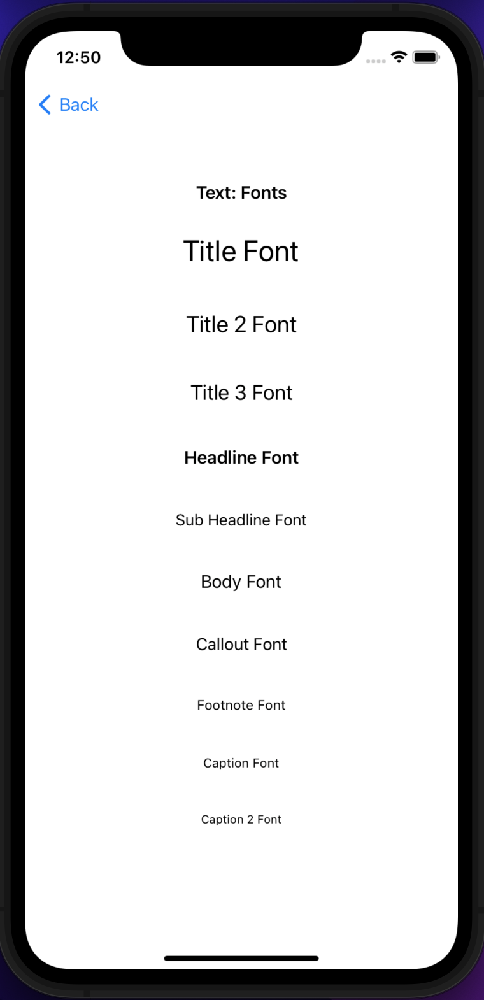
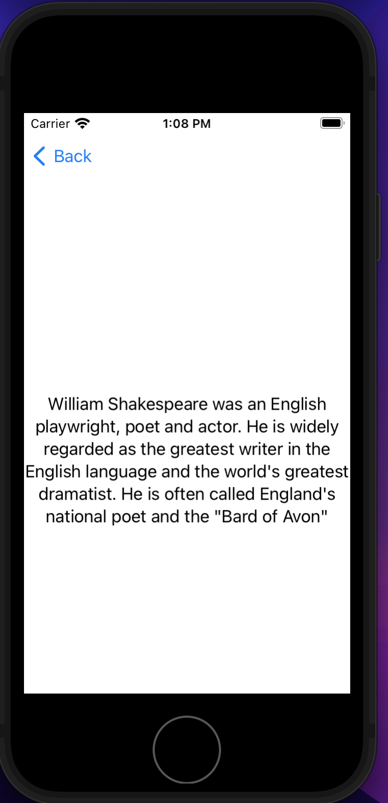
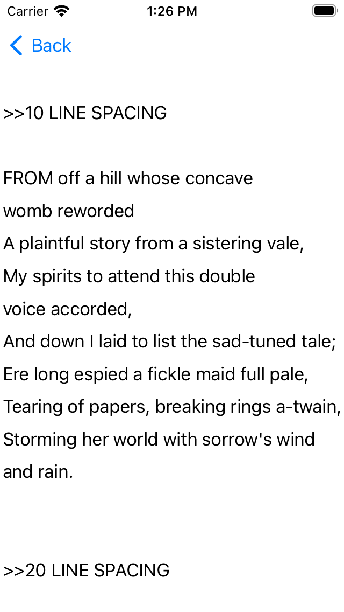
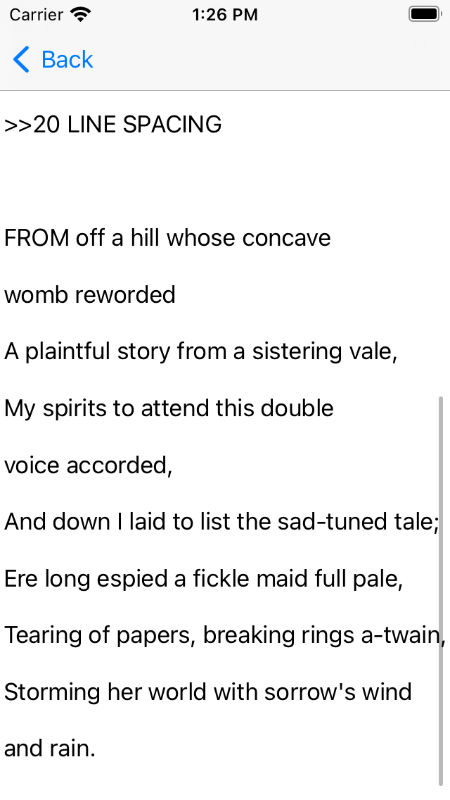

# Tsavo National Park App
> Simple app for learning/practicing some SwiftUI concepts.

# Lesson 1: SwiftUI App Life Cycle
Xcode offers two options for app life cycle when you open a new Xcode project:

1. **UIKit AppDelegate**
2. **SwiftUI**

## <b>SwiftUI</b>
Projects created with SwiftUI option generate an AppNameApp.swift root file.
This file becomes the app's **main entry point**.

This file contains a struct that conforms to **App** protocol

```swift
@main
struct TsavoNationalParkApp: App {
    var body: some Scene {
        WindowGroup {
            ContentView()
        }
    }
}
```

ContentView is also added to the main **Window**.
**@main** just above the struct declaration tells the system that this is the **main entry point in the app**.

### <u>SwiftUI WindowGroup</u>

A *scene* that represents a group of identical structured windows.

```swift
struct WindowGroup<Content> where Content : View
```

WindowGroup is used to create a view hierarchy for the app. The hierarchy that you declare for the view's contents serves as template for each window that the view displays.

SwiftUI takes care of platform specific behaviours, for example on macOS and iPadOS, users can open more than one window from the group simulatenously. In macOS users can gather multiple windows together into a **tabbed interface**.

Every window created from the group maintains **independent state**. For example, you cannot share **State** or **StateObjects** between windows.

### <u>@main</u>

**main()** initializes and runs the application.

If you preceded your app's **App Protocol conformer** with the **@main** attribute, the system calls the conformer's main() to launch the app in a system appropriate way.

```swift
@main
struct TsavoNationalParkApp: App {
    //window group - scene enclosed
}
```

### <u>Scene</u>

A scene is a part of the operating system with a lifecycle managed by the system.

You create an **App** by combining one or more instances that *conform* to the **Scene Protocol** in the apps's body. 
You can use inbuilt scenes such as **WindowGroup** or compose custom scenes from other scenes.

>Create custom scenes by creating a struct that conforms to the scene protocol

```swift
struct PlayerSettingScene: Scene {
    var body: some Scene {
        WindowGroup{
            PlayerSettingsContentView()
        }
    }
}
```

A scene acts as a container for a viwe hierarchy that you want to display to the user. The system descides when and how to display the scene to the user in a way that is **platform appropriate**.

You can check whether a scene is active or in some other state by reading the **scenePhase** environment value.

```swift
struct PlayerProfileScene: Scene {

    @Environemnt(\.scenePhase) private var scenePhase 

    var bodu: some Scene {
        WindowGroup {
            PlayerProfileContentView()
        }
    }
}
```

The scene protocol provides **scene modifiers**, <u>*defined as protocol methods with default implementation*</u>, that you use to configure the scene

```swift
@main
struct PlayerProfileScene: Scene {
    
    @Environment(\.scenePhase) private var scenePhase

    var body: some Scene {
        WindowGroup {
            ContentView()
        }
        .onChange(of: scenePhase){ newScenePhase in
            if newScenePhase == ScenePhase.background {
                //empty cache
                //perform some network calls
            }
        }
    }
}

```

### <u>@Environment.PresentationMode</u>
This indicates whether a view has been presented by another view

> **Depreacated as of iOS 15.5**
> Apple recommends using isPresented and dismiss environment objects instead

```swift
struct ProfileDetailsView: View {

    @Environment(\.presentationMode) private var presentationMode

    var body: some View {
        Button("< Exit") {
            presentationMode.wrappedValue.dismiss() //Close this view
        }
    }
}

```

### <u>@Environment.isPresented</u>

A Boolean value that indicated whether the view is currently presented.

>Immutable.

```swift
var isPresented: Bool { get }

// Value can be read from the @Environmment property wrapper

@Environment(\.isPresented) private var isPresented
```

This behaves differently from **onAppear()** which swift ui can call multiple times such as on back navigation.

### <u>@Environment.dismiss</u>

Use property wrapper value to get a handle on the currenct **DismissAction** instance on the currenct view.

Calling the instance performs the dismiss() action

> Immutable

```swift
var dismiss: DismissAction { get }
```

```swift
struct WeaponSelectorSheet: View {

    @Environment(\.dismiss) private var dismiss

    var body: some View {
        VStack{
            Label("Select weapon")
            ...

            Button("Save and Resume Game"){
                dismiss()
            }
        }
    }
}
```

- - -

# Lesson 2: SwiftUI ViewModifiers

A view modifier is a modifier that you apply to a view such as **Text** or **Label** or another modifier such a chained **font()** or **foreground()** producing a different version of the original modifier.

> Protocol

```swift
protocol ViewModifier
```

### Basic Usage

```swift
Text("Hello World!")
    .bold()
    .font(.title)
    .foregoround(.yellow)
```

### Creating a Custom View Modifiers

1. Create a struct that conforms to the **ViewModifier Protocol**

```swift
struct PrimaryTitleTextModifier: ViewModifier {}
```

2. Compose properties and return them as a **view**

```swift
struct PrimaryTitleStyle: ViewModifier {
    func body(content: Content) -> some View {
        content
            .font(.title)
            .padding()
            .overlay {
                RoundedRectangle(cornerRadius: 15)
                    .stroke(lineWidth: 6)
            }
            .foregroundColor(.black)
    }
}

struct SecondaryTitleStyle: ViewModifier {
    func body(content: Content) -> some View {
        content
            .font(.title3)
            .padding()
            .overlay {
                RoundedRectangle(cornerRadius: 15)
                    .stroke(lineWidth: 6)
            }
            .foregroundColor(.gray)
    }
}
```

3. Define an **extension** to **View** that itself integrates the new modifier

```swift
extension View {
    func applyPrimaryTitleStyle() -> some View {
        modifier(PrimaryTitleStyle)
    }
}
```

4. Apply the property to any view like so...

```swift
Text("Tsavo National Park")
    .applyPrimaryTitleStyle()
```

# Lesson 3: SwiftUI Text

A view that displays one or more lines of read only text

SwiftUI draws the text with a **body** font by default, you can apply a different font like **title** using the **font()** modifier.

```swift
Text("F1 Hamilton")
    .font(.caption)
```

### Use a system font or a custom font

You can use the **font()** modifier to set a system or custom font.

```swift
Text("A man liveth")
    .font(.system(size: 14, weight: .light, design: .serif))
```



### Line limit

Sets the maximum number of lines that the text can occupy on the view.

```swift
Text("Sweet are the uses of adversity which, like the toad, ugly and venomous, wears yet a precious jewel in his head")
    .lineLimit(1)
```

### Multiline Text Allignment(alignment:)

Sets the alignment of multiple text in this view.

```swift
Text("William Shakespeare was an English playwright, poet and actor. He is widely regarded as the greatest writer in the English language and the world's greatest dramatist. He is often called England's national poet and the \"Bard of Avon\" ")
    .multilineTextAlignment(.center)
```



### Line Spacing

Sets the amount of space between lines of text in this view.

```swift
func lineSpacing(_ lineSpacing: CGFloat) -> some View 
```
**lineSpacing** is the distance between the top of one line of text and the bottom of another.

```swift 
Text("FROM off a hill whose concave womb reworded
A plaintful story from a sistering vale,
My spirits to attend this double voice accorded,
And down I laid to list the sad-tuned tale;
Ere long espied a fickle maid full pale,
Tearing of papers, breaking rings a-twain,
Storming her world with sorrow's wind and rain.

Upon her head a platted hive of straw,
Which fortified her visage from the sun,
Whereon the thought might think sometime it saw
The carcass of beauty spent and done:
Time had not scythed all that youth begun,
Nor youth all quit; but, spite of heaven's fell rage,
Some beauty peep'd through lattice of sear'd age.")
    .lineSpacing(20)
```




